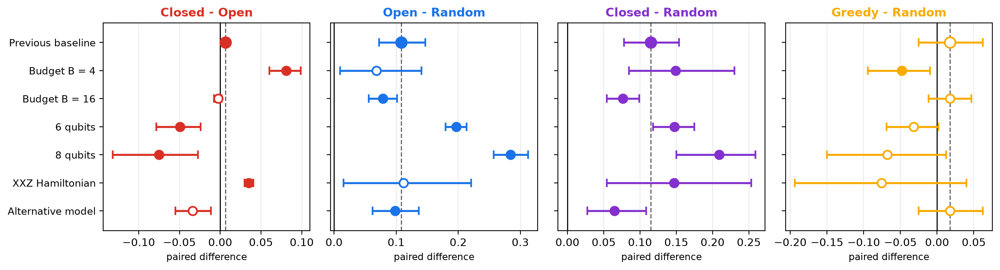
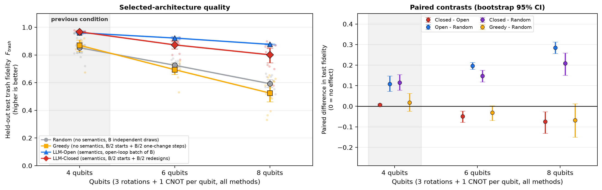
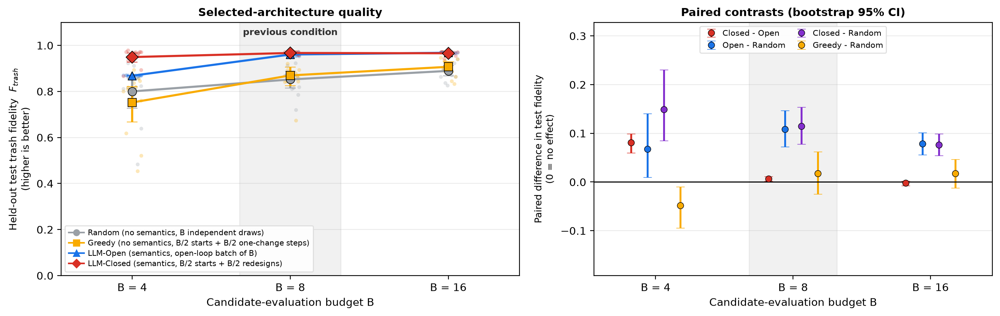
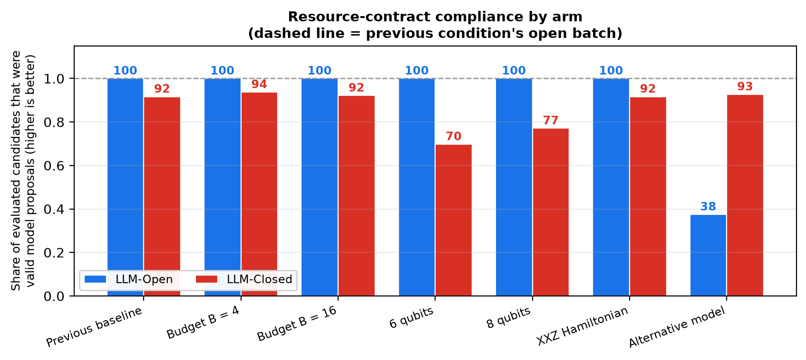

# Quantum Circuit Design with LLMs — GSoC 2026 with ML4SCI

*Tomoya Hatanaka ([@dorakingx](https://github.com/dorakingx)) · Google Summer of Code 2026 ·
[ML4SCI](https://ml4sci.org/) / QMLHEP*

> **TL;DR.** I built a fair test bench for asking whether a large language model (LLM) actually
> designs better variational quantum circuits than ordinary search does. In the test, every
> method gets the same budget and the same circuit size. The answer was more specific than
> "yes" or "no". The LLM's **prior knowledge** helped reliably: it beat random search in all
> six conditions I varied, and most strongly at 8 qubits. The **agentic feedback loop**, where
> the model is shown a score and asked to improve, did *not* help consistently. At 6 and 8
> qubits it made things significantly worse.
>
> Code: [frozen GSoC snapshot](https://github.com/dorakingx/llm-vqc/tree/gsoc-2026-final) ·
> Full methodology and statistics: [Final Report](./GSoC2026_FINAL_REPORT.md)

---

## Introduction

A **variational quantum circuit** (VQC) is a parameterised quantum circuit whose rotation angles
are trained by a classical optimizer, much like the weights of a neural network. The angles are
the easy part. The hard part is the *architecture*: which gates to use, on which qubits and in
what order. You can't differentiate with respect to "put a CNOT here", so the architecture has
to be **searched**. This is called quantum architecture search (QAS).

QAS is expensive for a simple reason: you can't score a candidate circuit until you have trained
it. Each evaluation costs a full optimisation run, so any realistic search only gets to look at
a handful of candidates. That makes it important *which* candidates you try first.

This is where language models become interesting. An LLM has read a lot of physics. Given a
description of the problem, such as "compress the ground states of a transverse-field Ising
chain", it may carry a useful **semantic prior** about which circuit structures are likely to
work. It might know that entanglers should follow the chain's nearest-neighbour structure, or
which rotation axes matter for a given Hamiltonian. A random or evolutionary search knows none
of this.

Earlier work, including my mentors' paper
[*AI Agents for Variational Quantum Circuit Design*](https://arxiv.org/abs/2602.19387), showed
that LLMs *can* design VQCs. Those demonstrations were qualitative, though: single runs, no
random or evolutionary baselines, no seed replication and no statistical tests.

## Project goal

So I did not set out to build yet another LLM agent. The question I converged on is an
*evaluative* one:

> Under a **budget-matched, capacity-controlled** comparison against search methods that know
> nothing about physics, does an LLM's semantic prior actually produce better circuit
> architectures? And does iterative feedback add anything on top of it?

The two qualifiers are what make the question hard to answer honestly:

- **Budget-matched:** every method gets exactly the same number of trained candidates.
- **Capacity-controlled:** every candidate circuit has exactly the same number of gates and
  trainable parameters, whichever method proposed it.

The project's very first "LLM wins" result disappeared once the second condition was enforced.
The LLM had simply been proposing *bigger* circuits.

## What I built

Everything lives in the [`llm_vqc`](https://github.com/dorakingx/llm-vqc/tree/gsoc-2026-final/llm_vqc)
Python package:

- **A shared circuit representation with a capacity contract.** Every candidate from every
  method is an ordered sequence of gates from `{RX, RY, RZ, CNOT}` with a fixed width rule:
  **3 trainable rotations plus 1 CNOT per qubit**, in free order with free wiring. The contract
  is checked for every single candidate, so no method can win by using a larger circuit.
- **A deterministic training and evaluation pipeline.** It uses one shared trainer: Adam,
  learning rate 0.05, 60 epochs, small uniform initialisation and a best-validation checkpoint.
  The training seed is derived from `(seed, architecture hash)`, so a given circuit is trained
  identically no matter which method proposed it. Selection and feedback only ever see
  **validation** scores. The held-out test set is read once, after selection is finished.
- **Search methods, all given the same budget:**
  - **Random** draws `B` independent circuits.
  - **Greedy** draws `B/2` random warm starts, then makes `B/2` single-gate mutations of the
    best one, keeping a mutation only if it improves validation.
  - **Evolutionary** is a population baseline, used in the earlier capacity-controlled
    benchmarks and the API verification stage.
  - **LLM-Open** asks the model for `B` circuits **in one batch, before any score is seen**. It
    never gets feedback, so anything it achieves comes from its prior alone.
  - **LLM-Closed** starts with `B/2` score-free warm starts. For the remaining `B/2`
    candidates, it repeatedly shows the model the current best circuit and its validation
    score, and asks for a free-form redesign.
- **An LLM layer with hard cost control.** It uses OpenAI structured outputs and pins exact
  model snapshots (e.g. `gpt-5.4-mini-2026-03-17`). Malformed or oversized proposals get a
  bounded number of repair attempts. After that, the slot falls back to a *flagged* random
  circuit, which still uses up budget, so the model pays for its own mistakes. **No paid call
  is ever made unless `LLM_API_BUDGET_USD` is set to an explicit nonzero cap.** The remaining
  budget is checked *before* every request.
- **Reproducibility infrastructure.** A manifest fingerprints everything that should stay
  fixed: prompts, output schema, trainer, data splits, selection rule, gate set, method logic
  and random-number streams. A test asserts that each experimental condition differs from the
  reference in **exactly one** factor. Every study's protocol was written and committed to Git
  *before* it was run. That ordering can be checked in the history. (No external
  preregistration service was used.)
- **Analysis tooling** for paired statistics (bootstrap confidence intervals, exact Wilcoxon
  and sign tests, effect sizes), plus figure, report and slide builders. There are **603
  tests**, and all of them run offline.

## Experimental setup

The benchmark task is a **quantum autoencoder** (QAE). Take ground states of a spin chain and
learn a circuit that compresses each state into half of the qubits (the "latent" register),
leaving the other half (the "trash" register) in `|0…0⟩`. The score is **trash fidelity**,
`F_trash`: the probability that all trash qubits are measured as 0. A score of 1 means perfect
compression. I chose this task because the objective is directly a quantum quantity, and
because the circuit budget can be controlled exactly. Earlier task choices, such as a
small-sample HIGGS classification setup, turned out to be degenerate: frozen parameters beat
trained ones and unentangled circuits beat entangled ones, so a comparison of search
strategies there would have measured noise.

The reference condition is 4 qubits, the open-chain transverse-field Ising model (TFIM), a
budget of `B = 8` trained candidates per method, and 12 paired random seeds. The final
experiment, the **one-factor robustness study**, then changes **exactly one** thing at a time:

| Factor | Values tested |
|---|---|
| Candidate budget `B` | 4, **8**, 16 |
| Number of qubits `n` | **4**, 6, 8 |
| Hamiltonian family | **TFIM**, XXZ Heisenberg chain |
| LLM | **`gpt-5.4-mini-2026-03-17`**, `gpt-4.1-mini-2025-04-14` |

Bold marks the reference value. That gives the reference cell plus six varied conditions. Each
method's selected circuit is the one with the lowest *validation* loss among its `B`
candidates, and all four methods are compared on the same seeds. Simulation is noiseless
state-vector.

## Key results

### 1. The semantic prior is robust

**LLM-Open beat Random in all 6 varied conditions, with statistical significance
(p < 0.05) in 4 of them.** The advantage grew as the problem got harder. At 8 qubits, LLM-Open
improved held-out trash fidelity by **+0.284** on average over Random, winning on 12 of 12
seeds. The paired effect size was `dz = 5.55`, which is very large.



*Paired per-seed differences in held-out trash fidelity (12 seeds, bootstrap 95% CI) for the
reference condition and the six varied conditions. Filled markers: exact two-sided Wilcoxon
p < 0.05. Dashed line: the reference condition's value. Read the blue column (Open − Random) for
the semantic prior, and the red column (Closed − Open) for the value of feedback.*

This is the cleanest result in the project, because LLM-Open **never sees a score**. Its
advantage can't come from feedback. It has to come from what the model already knows about
physics and circuit structure. In the two conditions where it wasn't significant, the mean
was still positive. At `B = 4` the gain was +0.068 (8/12 seeds, p = 0.064). For the XXZ chain
it was +0.112, but with only 5/12 seed wins and p = 0.79, driven by a heavy tail in Random's
results.

A useful control: **Greedy, which refines a good candidate but has no semantics, was not
significantly better than Random in any varied condition**, and was significantly *worse* at
`B = 4`. So the LLM's gain isn't just "refining a good starting point is useful". The
semantics are doing the work.



*Scaling with qubit count (every method uses 3 rotations + 1 CNOT per qubit). As the circuit
space grows, Random and Greedy degrade quickly while LLM-Open holds up. LLM-Closed falls
between them.*

### 2. More agentic feedback is not automatically better

The previous version of the benchmark (v5, now the reference cell) had found a small but
significant closed-loop advantage at 4 qubits: +0.0066, p = 0.012. It would have been easy
to headline that. The robustness study shows it **does not generalise**:

- LLM-Closed beat LLM-Open in only **2 of 6** varied conditions: the tight budget `B = 4`
  (+0.081) and the XXZ chain (+0.035).
- It **significantly reversed** at **6 qubits (−0.049, 0/12 seeds)** and **8 qubits (−0.075,
  1/12 seeds)**.



*Varying the budget. Feedback (red, Closed − Open) clearly helps at `B = 4` and fades to
nothing by `B = 16`, while the semantic prior (blue, Open − Random) stays positive throughout.*

One reading that fits the pattern: the closed loop spends half of a small budget on refining
one incumbent. That pays off when the budget is so tight that a single batch is too small.
But it costs exploration breadth, and that cost grows with the size of the circuit space. I
want to be careful here: this is an *interpretation* of the observed pattern. I didn't run a
dedicated experiment to isolate the cause.

Even so, **some LLM arm beat Random in every condition tested.** LLM-Closed − Random was
positive and significant in all 6 varied conditions.

### 3. Following the rules is a real failure mode

I also measured something that is easy to overlook: whether the model's proposals actually
satisfy the exact gate-count contract. Invalid proposals become flagged random fallbacks, and
those stay in the score.



*Share of evaluated candidates that were valid model proposals, by arm and condition.*

With the reference model, about 96% of evaluated LLM candidates were valid at 4 qubits. That
share dropped to 84.9% at 6 qubits and 88.5% at 8 qubits. With the alternative
`gpt-4.1-mini` model it fell to **65.1%**, mostly because only 38% of its open-loop batch
proposals were valid. Every LLM number in this post is therefore an *operational* score that
already pays for the model's own specification failures. It also means this study can't fully
separate "designs good architectures" from "follows the output contract".

### 4. A supporting check: how much budget do you need?

A final study turned the question around. Instead of ranking methods at a fixed budget, it
asks for the *smallest* budget at which a method reaches validation trash fidelity 0.95 on at
least 10 of the 12 seeds. This study never evaluated any candidate on the test set. The
smallest verified passing budget on 4-qubit TFIM was **`B = 6` for LLM-Open** (12/12 seeds)
and **`B = 8` for LLM-Closed**, which reached only 8/12 at `B = 6`. Random and Greedy passed
at none of the budgets tested. No method passed a stricter 0.99 target anywhere, and it is
still open whether search, training length or circuit capacity is the limiting factor.

### What these results do *not* say

They don't show quantum advantage: this is a comparison between *search strategies* on a
fixed, classically simulated quantum task. They don't show that LLMs are generally good
circuit designers. And they come with real limits: 12 seeds per cell, noiseless simulation,
one capacity rule, two Hamiltonian families and two model snapshots. The
[Final Report](./GSoC2026_FINAL_REPORT.md#56-limitations) lists these in full.

## What I learned

**Semantic priors can be valuable without any feedback.** The arm that *looks* least like an
agent, a single batch call that never sees a score, was the one whose advantage survived
everywhere. In this study the benefit came from score-free proposals made in response to a
physics description of the task, not from the feedback loop. Which parts of the prompt drive
that benefit is a separate question, and I didn't ablate it.

**More agentic is not automatically better.** Feedback costs budget. When the space is large,
that budget is often better spent on breadth than on refining one incumbent.

**Fair baselines are harder to build than the method you're testing.** Once circuit capacity
was matched, the project's first "LLM wins" result disappeared. Greedy had to be
rebuilt twice before it was a credible opponent. Only after it was given every structural
advantage the LLM had does "Greedy − Random is not significant in any varied condition" mean
something.

**Report the negative results as loudly as the positive ones.** The v5 closed-loop advantage
was real at its own operating point, and it was the more exciting headline. Writing it up as
*superseded* was the outcome that all the control machinery existed to make possible.

## Challenges

- **Experimental fairness.** Circuit size, budget, warm-start counts, trainer, data splits and
  selection rule all had to be identical across methods, and checked by code rather than by
  convention.
- **Stochastic LLM outputs.** Proposals vary from call to call and sometimes break the output
  schema. I handled this with structured outputs, bounded repairs, flagged fallbacks that stay
  in the analysis, and paired seeds. Every per-seed point is shown in the figures, not just
  averages.
- **API cost.** One earlier benchmark line was fully built, then blocked when the API account
  ran out of quota, with $0.00 spent. After that, every published number had to be
  regenerable from committed logs, with paid execution as a separate, explicitly capped step.
  The robustness study used 511 model calls (428,651 input / 225,577 output tokens). The
  budget-target study used 138 calls, costing USD 0.29 at list price.
- **Test-set hygiene.** An audit found historical result files that averaged *test*
  fidelity, which could have contaminated a budget decision. The budget-target study therefore
  hands the trainer an empty test array, and a guard fails the run if any recorded test
  quantity is finite.
- **Protocol freezing.** Writing the protocol down and committing it *before* each run slowed
  me down, but it is the only reason I can say the robustness study wasn't tuned to produce its
  headline.

## Code and reproducibility

- **Frozen GSoC source (tag `gsoc-2026-final`):**
  https://github.com/dorakingx/llm-vqc/tree/gsoc-2026-final
- **Canonical development repository:** https://github.com/dorakingx/llm-vqc
- **ML4SCI code submission (QMLHEP):** https://github.com/ML4SCI/QMLHEP/pull/50
- **Full Final Report** (methodology, every statistic, limitations):
  [`GSoC2026_FINAL_REPORT.md`](./GSoC2026_FINAL_REPORT.md)
- **Primary study protocol and results:**
  [`docs/research/QAE_ROBUSTNESS_PROTOCOL.md`](./docs/research/QAE_ROBUSTNESS_PROTOCOL.md) ·
  [`outputs/qae_robustness/REPORT.md`](./outputs/qae_robustness/REPORT.md)

Reproducing the results **doesn't require an API key**. The raw candidate logs of every
condition are committed, and every table, statistic and figure above is regenerated from them
with zero model calls:

```bash
git clone https://github.com/dorakingx/llm-vqc.git && cd llm-vqc
python -m venv .venv && source .venv/bin/activate
pip install -e ".[dev]"
./scripts/check.sh                                  # lint + 603 offline tests
python scripts/qae/build_qae_robustness_figures.py  # figures from committed logs
python scripts/qae/build_qae_robustness_report.py   # tables and statistics
```

Regenerating the *raw LLM candidate pools* from scratch does call the OpenAI API. It needs your
own key in `.env` **and** an explicit spending cap (`LLM_API_BUDGET_USD`). Without both, the
code refuses to make paid calls.

## Future work

These directions are all open. None of them has been run yet:

- **Larger systems and other tasks.** Push beyond 8 qubits and beyond the TFIM/XXZ autoencoder
  to other VQC objectives. The semantic advantage grew with system size here, and whether that
  trend continues is the most interesting open question.
- **Model and budget scaling.** Map the budget boundaries left deliberately unmeasured, and
  test more model snapshots. Repeat the two single-run budget-boundary cells with fresh
  generation seeds.
- **Explain the feedback reversal.** Design an experiment that isolates *why* the closed loop
  loses at 6–8 qubits, instead of inferring it.
- **Separate validity from quality.** Find a design that separates "proposes good
  architectures" from "follows the gate contract".
- **Diagnose the 0.99 ceiling,** and move towards **noise-aware and hardware-oriented
  evaluation**. Everything here is noiseless simulation.

## Acknowledgements

Thank you to **Google Summer of Code** and to **ML4SCI** for making this project possible, and
to the **QMLHEP** group for hosting it. I am especially grateful to my mentors, **Marco
Knipfer, Jogi Suda Neto, Konstantin Matchev and Katia Matcheva**, for their guidance
throughout the summer, and for encouraging the kind of careful, controlled evaluation that
ended up shaping every result in this post.
