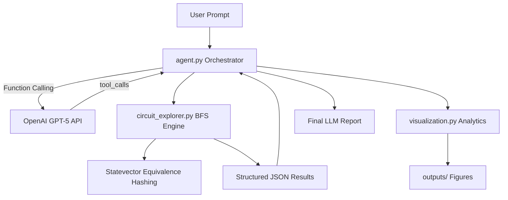

# LLM-VQC: Autonomous Agent Framework for Variational Quantum Circuit Exploration

An advanced autonomous agent framework that couples large language models (GPT-5 series) with a high-performance quantum circuit search engine to explore, classify, and visualize equivalence classes of Clifford circuits built from standard gate sets.

The system uses **OpenAI Function Calling** for reasoning and orchestration, and **Qiskit** for Clifford/Stabilizer simulation, rigorous statevector equivalence hashing, and publication-quality visualization.

---

## Project Overview

Designing Variational Quantum Circuits (VQCs) requires navigating an exponentially large combinatorial space of gate sequences. This project automates that exploration by delegating high-level scientific reasoning to an LLM while executing precise quantum simulations locally.

Given a qubit count `N` and maximum depth `G`, the agent:

1. Interprets a natural-language research question (e.g., *"How many unique stabilizer states are reachable with exactly 5 gates on 3 qubits?"*).
2. Invokes the `explore_circuit_space` tool with appropriate parameters.
3. Analyzes structured exploration results and produces a human-readable scientific report.
4. Automatically generates visual analytics in the `outputs/` directory.

All gates in the standard set `{H, X, Y, Z, CX, CY, CZ}` are Clifford gates, enabling efficient simulation without dense statevector evolution during search.

---

## System Architecture



### 1. The Orchestrator (`agent.py`)

The orchestrator implements a custom LLM agent loop on top of the official OpenAI Python SDK.

**Responsibilities:**

- Maintains conversation history and system instructions for quantum exploration tasks.
- Registers `explore_circuit_space` as a strict JSON-schema tool.
- Executes the tool locally when the model requests it, appends results to the message history, and re-queries the model for final analysis.
- Stores the most recent tool result in `agent.last_tool_result` for downstream visualization.

This separation ensures the LLM never performs quantum simulation itself—it reasons about *when* and *how* to explore, while deterministic code handles execution.

### 2. The Explorer Tool (`circuit_explorer.py`)

The explorer is the backend execution engine. It performs **Breadth-First Search (BFS)** over the Clifford gate space up to depth `G`.

**Key mechanisms:**

| Mechanism | Description |
|-----------|-------------|
| **Clifford compose simulation** | Gate effects are accumulated via fast Clifford composition—no `Statevector` simulation during BFS. |
| **Topological pruning** | Consecutive identical gates are skipped because all gates are self-inverses (`G·G = I`). |
| **Equivalence class hashing** | After each candidate circuit, the resulting state is hashed; previously seen states are pruned. |
| **Minimum-depth retention** | BFS guarantees the first circuit reaching each state is the shortest one. |

**Returned metrics include:**

- `total_unique_states` — all distinct physical states with minimum depth ≤ G
- `states_at_exact_depth_G` — states first discovered at exactly depth G
- `exploration_trajectory` — step-by-step discovery history
- `best_circuit` — representative minimum-depth circuit at target depth
- `gate_distribution` — gate-type frequency across all simplest circuits
- `sample_circuits` — diverse examples for LLM interpretation

### 3. Equivalence Class Hashing

Two circuits that produce the same physical quantum state (modulo global phase) must map to the same equivalence class. The `state_key` function enforces this rigorously:

1. **State construction:** `Statevector.from_int(0, 2**N).evolve(clifford)` computes `U|0…0⟩` without expensive circuit synthesis.
2. **Global phase normalization:** The first significant amplitude is rotated to be positive real via NumPy vectorized operations.
3. **Numerical stabilization:** Real and imaginary parts are rounded to 5 decimal places.
4. **Hashing:** The normalized complex128 array is converted to bytes and used as a dictionary key.

This approach is more physically accurate than stabilizer-generator label hashing, which can split equivalent states when different generator sets describe the same subspace.

### 4. Visualization Layer (`visualization.py`)

After exploration completes, `main.py` calls `generate_exploration_visualizations()` to produce:

| Output | Description |
|--------|-------------|
| `outputs/exploration_trajectory.png` | Cumulative unique states vs iteration and vs search depth |
| `outputs/gate_distribution.png` | Bar chart of gate-type frequency across simplest circuits |
| `outputs/best_circuit.png` | Qiskit Matplotlib diagram of the representative best circuit |
| `outputs/best_circuit.txt` | ASCII fallback diagram and gate sequence |

Visualization code uses the non-interactive `Agg` backend, creates the `outputs/` directory automatically, and degrades gracefully if optional rendering dependencies are missing.

---

## Getting Started

### Prerequisites

- Python 3.10+
- OpenAI API key with access to GPT-5 series models

### Installation

```bash
git clone https://github.com/dorakingx/llm-vqc.git
cd llm-vqc
python -m venv .venv
source .venv/bin/activate   # Windows: .venv\Scripts\activate
pip install -e .
```

### Environment Configuration

Copy the template and add your credentials:

```bash
cp .env.example .env
```

Edit `.env`:

```env
OPENAI_API_KEY=your_api_key_here
OPENAI_MODEL=gpt-5.4-mini   # fast dev/smoke tests
# OPENAI_MODEL=gpt-5.5      # production / heavy reasoning
```

### Run the Agent

```bash
python -m llm_vqc.main
```

The agent will explore the default task (`N=3`, `G=5`), print an LLM-generated report, and save visualizations to `outputs/`.

### Direct API Usage (without LLM)

```python
from llm_vqc import explore_circuit_space

result = explore_circuit_space(num_qubits=3, max_depth=5)
print(result["total_unique_states"])
print(result["gate_distribution"])
```

---

## Project Layout

```
llm-vqc/
├── llm_vqc/
│   ├── agent.py              # LLM orchestrator (OpenAI Function Calling)
│   ├── circuit_explorer.py   # BFS engine + equivalence hashing
│   ├── visualization.py      # Matplotlib / Qiskit analytics
│   └── main.py               # CLI entry point
├── tests/                    # Unit and smoke tests
├── outputs/                  # Generated figures (gitignored)
├── .env.example
├── pyproject.toml
└── requirements.txt
```

---

## Development

Run the test suite:

```bash
python -m pytest tests/ -q
```

---

## License

See repository for license details.
