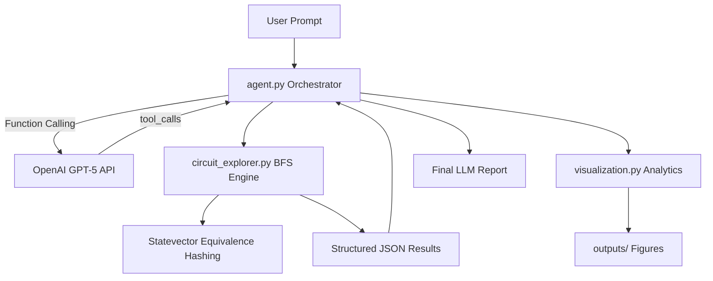

# LLM-VQC — when does language-model reasoning actually help quantum circuit architecture search?

> ## GSoC 2026 Final Work Product
>
> See **[GSoC2026_FINAL_REPORT.md](./GSoC2026_FINAL_REPORT.md)**
> for the final project summary, contributions, results, and reproduction instructions.
>
> **`main` is the canonical branch** — it is the only development branch, and it contains
> everything needed to understand and reproduce the final work. Superseded research lines
> are preserved read-only under [`archive/`](./archive).
>
> **Primary final experiment:** the controlled one-factor-at-a-time **QAE robustness study**
> — protocol [`docs/research/QAE_ROBUSTNESS_PROTOCOL.md`](./docs/research/QAE_ROBUSTNESS_PROTOCOL.md),
> results [`outputs/qae_robustness/REPORT.md`](./outputs/qae_robustness/REPORT.md).
>
> Immutable final snapshot: tag **`gsoc-2026-final`**.

This repository contains a **budget-matched, capacity-controlled, pre-registered evaluation**
of large language models as a quantum architecture search (QAS) strategy for variational
quantum circuits, benchmarked against Random, Greedy and Evolutionary search on a quantum
autoencoder task.

**Headline result.** The LLM's *score-free semantic prior* is a robust advantage — LLM-Open
beats Random in **6/6** varied conditions (up to **+0.284**, `dz = 5.55`, at 8 qubits). Its
*iterative feedback loop* is **not** — LLM-Closed beats LLM-Open in only **2/6** conditions and
significantly **reverses** at 6 and 8 qubits. No claim of quantum advantage or of general LLM
superiority is made; see the
[final report](./GSoC2026_FINAL_REPORT.md#5-main-results) for the full statistics, negative
results and limitations.

The project **began** as an autonomous agent that explores equivalence classes of Clifford
circuits (OpenAI function calling + Qiskit stabilizer simulation + statevector equivalence
hashing). That tooling is retained and documented below under
[Project Overview](#project-overview), but it is **not** the final scientific contribution.

---

## Current research line (start here)

`main` is the single active research branch. The current study asks:
**when does language-model reasoning actually help VQC architecture search?**

1. **Capacity-controlled benchmarks (T1/T2)** — with circuit size, training, and
   budgets matched, Random / Evolutionary / Greedy search are practically
   equivalent: `outputs/capacity_controlled_t2_v1/report.md`.
2. **Task qualification (HIGGS archives)** — why under-qualified tasks produce
   misleading search comparisons: `docs/research/HIGGS_ARCHIVE_SYNTHESIS.md`.
3. **Semantic QAE benchmark** — a quantum-autoencoder task in a neutral
   capacity-controlled space (free ordering of 12 rotations + 4 CNOTs),
   comparing Random / Greedy / LLM-Open / LLM-Closed with a version-pinned
   API model. **v5**: pre-registered incumbent-based free-form
   redesign — the LLM-Closed refinement step receives only the current best
   architecture + validation score and may redesign freely within capacity;
   first detected closed-loop advantage over the open-loop batch:
   `outputs/qae_tfim_neutral_v5/REPORT.md`. **v5 is the reference cell of the
   primary study (4) below, reused bit-for-bit — its closed-loop finding was
   subsequently shown NOT to generalise, so it is no longer the headline
   result.** **v4** (multi-start, archived):
   `outputs/qae_tfim_neutral_v4/REPORT.md`. **v3** (single-start
   diagnostic, archived): `outputs/qae_tfim_neutral_v3/REPORT.md`.
   (Earlier rigid-layout verification: `outputs/qae_tfim_api_v2/REPORT.md`;
   the 2026-08-04 historical synthetic-task artifacts:
   `outputs/mini5_ctx_20260804/`.)

4. **Controlled robustness study — PRIMARY RESULT** — the previous QAE result
   stress-tested by changing exactly one factor at a time: candidate budget
   `B in {4, 8, 16}`, qubit count `n in {4, 6, 8}`, Hamiltonian family
   (TFIM vs XXZ) and the underlying LLM model. Every other component —
   prompts, schema, retry policy, trainer, optimizer, splits, selection rule,
   gate set, method logic, RNG streams and analysis conventions — is frozen
   and machine-verified per condition:
   `outputs/qae_robustness/REPORT.md`, deck in `outputs/qae_robustness/deck/`.
   **Findings:** LLM-Open − Random keeps its sign in **6/6** varied conditions
   (significant in 4/6), and Closed − Random in 6/6 (significant 6/6); but
   **Closed − Open holds in only 2/6 and significantly reverses at 6 and 8
   qubits**, so iterative feedback does not generalise. Greedy − Random is
   significant in **0/6**. A further negative finding: LLM resource-contract
   compliance falls to **65.1%** with the weaker model.

5. **Minimum budget to a target fidelity (most recent, supporting)** — instead of ranking
   methods at one fixed budget, fix a target *validation* trash fidelity and
   ask for the smallest candidate budget that reaches it in at least 10 of the
   same 12 paired seeds. Seven earlier conditions are re-analysed with no model
   calls; two pre-registered boundary cells were newly executed. Measured at
   target 0.95: the open loop passes at `B = 6` (12/12) where the closed loop
   does not (8/12), and the XXZ closed-loop cell fell from 9/12 at `B = 8` to
   5/12 at `B = 10`. Attainment counts are **not** monotone in budget, so the
   report gives smallest verified passing budget / verified failing budgets /
   unverified budgets rather than an interval. No candidate is evaluated on the
   test set anywhere in this study:
   `outputs/qae_budget_targets_v2_20260908/REPORT.md`
   (Japanese summary: `SUMMARY_JA.md`; deck in
   `outputs/qae_budget_targets_v2_20260908/deck/`).

Key documents: `docs/research/RESEARCH_ROADMAP_QAE.md` (story),
`docs/research-log.md` (phase status, decisions and gates),
`docs/research/QAE_BUDGET_TARGET_PROTOCOL.md` (pre-registered budget-target protocol),
`docs/research/QAE_ROBUSTNESS_PROTOCOL.md` (pre-registered robustness protocol),
`docs/research/QAE_PROTOCOL_V5.md` (pre-registered primary protocol),
`docs/research/QAE_PROTOCOL_V4.md` / `QAE_PROTOCOL_V3.md` (archived),
`docs/research/QAE_PROTOCOL.md` (v1/v2 protocol),
`docs/research/LLM_QAE_SKILL.md` (prompt/skill lineage),
`docs/research/BRANCH_STATUS.md` (branch/PR map), `paper/main.tex` (manuscript).

Reproduce the primary QAE benchmark:

```bash
python scripts/qae/run_qae_tfim_neutral_v5.py --no-api   # Random + Greedy only
LLM_API_BUDGET_USD=2.00 python scripts/qae/run_qae_tfim_neutral_v5.py  # full (paid API)
python scripts/qae/build_qae_v5_figures.py               # figures from stored CSVs
```

Reproduce the robustness study (each condition is resumable):

```bash
python scripts/qae/run_qae_robustness.py --estimate --conditions all
LLM_API_BUDGET_USD=5.00 python scripts/qae/run_qae_robustness.py --conditions all
python scripts/qae/build_qae_robustness_figures.py
python scripts/qae/build_qae_robustness_report.py
python scripts/qae/build_qae_robustness_slice_figures.py  # tested one-factor slices
python scripts/qae/build_qae_robustness_slides.py         # 10-slide deck + PDF (audited)
```

Reproduce the budget-target study (validation only; no test evaluation):

```bash
python scripts/qae/run_budget_target.py --list --estimate --status
LLM_API_BUDGET_USD=2.00 python scripts/qae/run_budget_target.py --cells all
python scripts/qae/run_budget_target.py --cells all --reuse-only   # no key, no cap
python scripts/qae/analyze_budget_targets.py \
  --root outputs/qae_robustness --out outputs/qae_budget_targets_v2_20260908/audit \
  --extra-condition target_tfim_b6:6:all:outputs/qae_budget_targets_v2_20260908 \
  --extra-condition target_xxz_b10:10:LLM-Closed:outputs/qae_budget_targets_v2_20260908
python scripts/qae/build_budget_target_figures.py \
  --audit outputs/qae_budget_targets_v2_20260908/audit
```

---

## Project Overview

Designing Variational Quantum Circuits (VQCs) requires navigating an exponentially large combinatorial space of gate sequences. This project automates that exploration by delegating high-level scientific reasoning to an LLM while executing precise quantum simulations locally.

Given a qubit count `N` and maximum depth `G`, the agent:

1. Interprets a natural-language research question (e.g., *"How many unique stabilizer states are reachable with exactly 5 gates on 3 qubits?"*).
2. Invokes the `explore_circuit_space` tool with appropriate parameters.
3. Analyzes structured exploration results and produces a human-readable scientific report.
4. Automatically generates visual analytics in the `outputs/` directory.

All gates in the standard set `{H, X, Y, Z, CX, CY, CZ}` are Clifford gates, enabling efficient simulation without dense statevector evolution during search.

---

## System Architecture



### 1. The Orchestrator (`agent.py`)

The orchestrator implements a custom LLM agent loop on top of the official OpenAI Python SDK.

**Responsibilities:**

- Maintains conversation history and system instructions for quantum exploration tasks.
- Registers `explore_circuit_space` as a strict JSON-schema tool.
- Executes the tool locally when the model requests it, appends results to the message history, and re-queries the model for final analysis.
- Stores the most recent tool result in `agent.last_tool_result` for downstream visualization.

This separation ensures the LLM never performs quantum simulation itself—it reasons about *when* and *how* to explore, while deterministic code handles execution.

### 2. The Explorer Tool (`circuit_explorer.py`)

The explorer is the backend execution engine. It performs **Breadth-First Search (BFS)** over the Clifford gate space up to depth `G`.

**Key mechanisms:**

| Mechanism | Description |
|-----------|-------------|
| **Clifford compose simulation** | Gate effects are accumulated via fast Clifford composition—no `Statevector` simulation during BFS. |
| **Topological pruning** | Consecutive identical gates are skipped because all gates are self-inverses (`G·G = I`). |
| **Equivalence class hashing** | After each candidate circuit, the resulting state is hashed; previously seen states are pruned. |
| **Minimum-depth retention** | BFS guarantees the first circuit reaching each state is the shortest one. |

**Returned metrics include:**

- `total_unique_states` — all distinct physical states with minimum depth ≤ G
- `states_at_exact_depth_G` — states first discovered at exactly depth G
- `exploration_trajectory` — step-by-step discovery history
- `best_circuit` — representative minimum-depth circuit at target depth
- `gate_distribution` — gate-type frequency across all simplest circuits
- `sample_circuits` — diverse examples for LLM interpretation

### 3. Equivalence Class Hashing

Two circuits that produce the same physical quantum state (modulo global phase) must map to the same equivalence class. The `state_key` function enforces this rigorously:

1. **State construction:** `Statevector.from_int(0, 2**N).evolve(clifford)` computes `U|0…0⟩` without expensive circuit synthesis.
2. **Global phase normalization:** The first significant amplitude is rotated to be positive real via NumPy vectorized operations.
3. **Numerical stabilization:** Real and imaginary parts are rounded to 5 decimal places, then negative zero (`-0.0`) is canonicalized to positive zero (`+0.0`) — see the note below.
4. **Hashing:** The normalized complex128 array is converted to bytes and used as a dictionary key.

This approach is more physically accurate than stabilizer-generator label hashing, which can split equivalent states when different generator sets describe the same subspace.

> **Fixed bug (2026-07-12):** `state_key` previously hashed rounded real/imaginary parts without canonicalizing the sign of zero. IEEE754 gives `-0.0` and `+0.0` distinct byte representations even though they are numerically equal, so two circuits reaching the identical physical state could receive different keys whenever a rounded amplitude landed on zero with opposite signs. This silently inflated every "unique state" count ever reported by this tool (verified example: N=2 previously reported 82 states instead of the true 60; N=3 at depth 5 previously reported 893 instead of 666). All figures and data under `outputs/` predating this fix are archived under `outputs/archive_pre_negative_zero_fix_2026-07/` and must not be treated as correct. See `tests/test_circuit_explorer_regression.py` for the regression tests and `DECISIONS.md` for the full writeup.

#### Known-correct reachable state counts

The number of pure stabilizer states on `n` qubits is the closed-form quantity `2^n * ∏_{k=1}^{n} (2^k + 1)` (6, 60, 1080, 36720 for n = 1–4). With the fix above, exhaustive BFS over the gate set `{H, X, Y, Z, CX, CY, CZ}` saturates at:

| N (qubits) | Reachable states | Full stabilizer count | Saturates at depth |
|---|---|---|---|
| 1 | **4** | 6 | 2 |
| 2 | **60** | 60 | 6 |
| 3 | **1080** | 1080 | 8 |

**N=1 is an intentional partial coverage, not a bug.** The gate set omits the S (phase) gate, so it is not Clifford-complete on a single qubit: the two Y eigenstates `|+i⟩` and `|-i⟩` cannot be reached from `{H, X, Y, Z}` alone, leaving only 4 of the 6 single-qubit stabilizer states reachable. At N≥2, `CY` supplies the missing relative phase between computational-basis amplitudes and full coverage of all stabilizer states is restored (confirmed for N=2 and N=3 above; expected to continue holding for larger N by the same mechanism, though this has not been exhaustively checked past N=3 due to the exponential cost of the search).

### 4. Visualization Layer (`visualization.py`)

After exploration completes, `main.py` calls `generate_exploration_visualizations()` to produce:

| Output | Description |
|--------|-------------|
| `outputs/exploration_trajectory.png` | Cumulative unique states vs iteration and vs search depth |
| `outputs/gate_distribution.png` | Bar chart of gate-type frequency across simplest circuits |
| `outputs/pruning_efficiency.png` | Log-scale comparison of theoretical vs explored vs unique states |
| `outputs/state_probabilities.png` | Measurement probabilities for the most complex discovered state |
| `outputs/best_circuit.png` | Qiskit Matplotlib diagram of the representative best circuit |
| `outputs/best_circuit.txt` | ASCII fallback diagram and gate sequence |

Visualization code uses the non-interactive `Agg` backend, creates the `outputs/` directory automatically, and degrades gracefully if optional rendering dependencies are missing.

---

## Getting Started

### Prerequisites

- Python 3.10+
- OpenAI API key with access to GPT-5 series models

### Installation

```bash
git clone https://github.com/dorakingx/llm-vqc.git
cd llm-vqc
python -m venv .venv
source .venv/bin/activate   # Windows: .venv\Scripts\activate
pip install -e .
pip install -e ".[dev]"     # adds pytest + ruff
```

#### Reproducible environment (pinned lock)

`requirements-lock.txt` pins every transitive dependency version exactly
as used during development (Phase 0 through Phase 2), for exact
reproducibility of test results and experiment runs. Key pins as of
Phase 2: `torch==2.13.0` (CPU build; see below), `scikit-learn==1.9.0`,
`pennylane==0.45.1`, `qiskit==2.4.1`.

- **Target Python:** 3.14 (CPython). The project's own `requires-python`
  bound in `pyproject.toml` is `>=3.10`; the lock file itself reflects one
  specific tested environment, not the full supported range.
- **Platform:** macOS, arm64 (Apple Silicon). Some pinned wheels
  (`pennylane_lightning`, `scipy`, `rustworkx`, `torch`) are
  platform-specific binary distributions; installing this exact lock file
  on Linux/Windows or on x86_64 may fail to resolve and would need
  regenerating on that platform instead of reusing this file as-is.
- **CPU vs GPU:** the pinned `torch` is a standard PyPI wheel, which on
  most platforms resolves to a CPU-only or CPU+CUDA-capable build
  depending on the host; this project's evaluation harness only ever
  requests `device="cpu"` (`llm_vqc.evaluation.training.TrainingConfig.
  device`, currently the only supported value) and every model/tensor is
  constructed on CPU explicitly, so GPU availability does not affect
  reproducibility of results — it is simply unused. Do not assume a CUDA
  build is present; install the CPU-only PyTorch wheel if disk space or a
  CUDA toolkit is a concern (`pip install torch --index-url
  https://download.pytorch.org/whl/cpu`), then re-run `pip install -e .`.
- **Install from the lock** (exact reproduction, same platform/Python):
  ```bash
  pip install -r requirements-lock.txt
  pip install -e . --no-deps   # install this package itself, deps already pinned above
  ```
- **Regenerate the lock** after intentionally changing dependencies (edit
  `pyproject.toml` first, then):
  ```bash
  python -m venv .venv-relock && source .venv-relock/bin/activate
  pip install -e ".[dev]"
  pip freeze | grep -v '^-e ' > requirements-lock.txt
  ```
- **Verified:** this exact lock file was installed into a brand-new,
  empty virtualenv and the full test suite (223 tests as of Phase 2) was
  run against it end to end — see `DECISIONS.md` Phase 2 section for the
  command transcript.

### Environment Configuration

Copy the template and add your credentials:

```bash
cp .env.example .env
```

Edit `.env`:

```env
OPENAI_API_KEY=your_api_key_here
OPENAI_MODEL=gpt-5.4-mini   # fast dev/smoke tests
# OPENAI_MODEL=gpt-5.5      # production / heavy reasoning
```

### Run the Agent

```bash
python -m llm_vqc.main
```

The agent will explore the default task (`N=3`, `G=5`), print an LLM-generated report, and save visualizations to `outputs/`.

### Direct API Usage (without LLM)

```python
from llm_vqc import explore_circuit_space

result = explore_circuit_space(num_qubits=3, max_depth=5)
print(result["total_unique_states"])
print(result["gate_distribution"])
```

---

## Project Layout

```
llm-vqc/
├── GSoC2026_FINAL_REPORT.md  # ★ GSoC 2026 Final Work Product (start here)
├── archive/                  # read-only copies of superseded, disconnected research
│   ├── README.md             #   provenance: source branch tips, why superseded
│   └── pre-consolidation/    #   HIGGS, bench_v2 (blocked), free-amplitude, mini-demo
├── llm_vqc/
│   ├── experiments/
│   │   ├── qae_robustness/   # ★ PRIMARY experiment (arms, prompts, manifest, study)
│   │   ├── qae_budget_targets/  # supporting minimum-budget study
│   │   ├── qae_tfim/         # QAE v2 → v5 lineage
│   │   └── capacity_controlled/ # T1/T2 capacity-controlled benchmarks
│   ├── agent.py              # LLM orchestrator (OpenAI Function Calling) — Phase 0 legacy
│   ├── circuit_explorer.py   # Discrete Clifford BFS engine + equivalence hashing
│   ├── visualization.py      # Matplotlib / Qiskit analytics — Phase 0 legacy
│   ├── main.py                # CLI entry point — Phase 0 legacy
│   ├── config.py, manifest.py, runner.py   # Config → run-dir → manifest scaffolding
│   ├── ir/                   # Shared typed circuit IR + compiler (Phase 1) — see llm_vqc/ir/README.md
│   ├── tasks/                 # T1/T2 data + splits + preprocessing (Phase 2), no test-data leakage
│   ├── evaluation/            # Fixed training pipeline, harness, quarantined final-test path, result store (Phase 2)
│   ├── diagnostics/           # Expressibility, Meyer-Wallach, gradient variance (Phase 3) — see llm_vqc/diagnostics/README.md
│   ├── search/                # Shared search framework + random/evolutionary/greedy/llm_iter/llm_evo arms (Phase 4/5)
│   └── llm/                   # LLM provider abstraction, cost-cap enforcement, mocked-provider validation (Phase 5)
├── tests/
│   └── fixtures/             # Re-encoded published reference circuits
├── configs/                  # Example run configs (dummy, T1/T2 smoke, diagnostics smoke, resume, search smoke)
├── scripts/
│   ├── check.sh               # Local lint + test CI script
│   ├── smoke_evaluate.py      # Phase 2 smoke workflow (train/eval harness + resumable store)
│   ├── smoke_diagnostics.py   # Phase 3 smoke workflow (diagnostics + resumable store)
│   ├── smoke_search_comparison.py  # Phase 4/5 smoke comparison across all 5 arms (system validation only)
│   ├── pilot_experiment.py    # Phase 6 real pilot: random/evolutionary/greedy, T1, B=25, 3 seeds
│   └── analyze_pilot.py       # Reproducible statistical analysis of pilot_experiment.py's stored results
├── outputs/                  # Generated figures (gitignored)
├── runs/                     # Run directories with manifests + result stores (gitignored)
├── LLM-VQC_MASTER_PLAN.md    # Authoritative research design and phase roadmap
├── DECISIONS.md              # Phase-by-phase completion record and design decisions
├── requirements-lock.txt     # Pinned dependency lock (see "Reproducible environment" above)
├── .env.example
└── pyproject.toml
```

**Current status:** the project is executing `LLM-VQC_MASTER_PLAN.md`'s
phased LAQS-Bench roadmap. Phase 0-3 are complete: a corrected discrete
BFS engine, a shared circuit IR + compiler, a fixed leakage-resistant
task/evaluation harness for T1 (Gaussian-peak regression) and T2 (sklearn
digits 3-vs-8 — see `DECISIONS.md` Gate G1 for why the original ECAL
dataset was replaced), and a backend-validated diagnostic layer
(expressibility, Meyer-Wallach entangling capability, gradient variance).
Phase 4/5 are also complete: a durable, crash-safe `BudgetLedger`, a
shared `SearchRunner` every arm is driven through identically, and five
search arms — `random`, `evolutionary`, `greedy` (all real, pilot-tested)
and `llm_iter`/`llm_evo` (fully implemented and first validated against
an offline `MockLLMProvider`). A real OpenAI mini integration experiment
subsequently completed, and a real Groq GPT-OSS 20B free-tier pilot was
started. In the Groq pilot all 9 non-LLM cells completed, but only two
`llm_open` cells ran partially before severe rate-limit delays led to
interruption; the other LLM cells were not started. This is descriptive
integration evidence, not a completed LLM comparison. A separate real
non-LLM pilot (T1, budget 25, 3 seeds) has also been run and analyzed —
see `DECISIONS.md` Stage 8. `agent.py`, `main.py`, and
`visualization.py` are Phase 0 legacy components retained for their
working BFS/equivalence engine — they are not the project's current
research direction. See the master plan and `DECISIONS.md` for what each
phase delivered, and `DECISIONS.md`'s final report for the full pilot
results, statistics, and recommended next steps.

### Presentation artifacts

Sanitized, repository-safe CSV/JSON/report/plot packages generated from
durable experiment data, without raw stores, prompts, or credentials —
see [`docs/presentation/`](docs/presentation/):

- [`mini_llm_experiment/`](docs/presentation/mini_llm_experiment/) — the
  first real-API (OpenAI) time-boxed smoke integration run.
- [`groq_pilot/`](docs/presentation/groq_pilot/) — the interrupted Groq
  GPT-OSS 20B free-tier pilot.

---

## Development

Run the test suite:

```bash
python -m pytest tests/ -q
```

Run lint + tests together (what `DECISIONS.md` and CI expect before any
commit):

```bash
bash scripts/check.sh
```

---

## License

> **⚠ Licensing is currently UNRESOLVED.**
>
> This repository has **no `LICENSE` file**, and GitHub detects no licence. Under default
> copyright that means **no reuse rights are granted**, which is very likely not the intent
> for a GSoC work product.
>
> A licence has deliberately **not** been chosen here, because ML4SCI or the mentors may
> already require a specific one. **Action required:** confirm the organization's required
> licence and add the corresponding `LICENSE` file.

**Data and dependencies.** All datasets behind the final results are **generated locally**
(TFIM and XXZ ground states by exact diagonalisation); no external dataset is redistributed.
[`DECISIONS.md`](./DECISIONS.md) records the provenance diligence on the ML4SCI
electron-photon ECAL dataset, including the decision *not* to use an unofficial re-upload of
unclear licence. Third-party dependencies (Qiskit, PennyLane, PyTorch, scikit-learn, pandas,
SciPy, matplotlib, openai, pydantic, python-pptx) are used unmodified from their public
distributions under their own permissive licences; none is vendored here.
