# REAL-LLM JOINT-SEARCH RUN (OpenAI)

# Free-Amplitude Fixed-Readout -- Joint Structure-and-Theta Search

**Main mode: the LLM/sampler proposes both the circuit structure AND the numerical angles; there is NO optimizer and NO classical layer (`classical_parameter_count = 0`). The prediction is `mu_hat = (1 - <Z_0>) / 2`.** This is an integration/smoke demonstration, not a scientific performance claim.

Elapsed: 24.3s.

## Selected candidate per arm/seed

| seed | arm | val RMSE | test RMSE | test MAE | q params | body depth | classical params |
|---|---|---|---|---|---|---|---|
| 0 | Random | 0.1691 | 0.1741 | 0.1478 | 1 | 1 | 0 |
| 0 | LLM Open-loop | 0.1423 | 0.1528 | 0.1305 | 2 | 2 | 0 |
| 0 | LLM Closed-loop | 0.1249 | 0.1285 | 0.0990 | 4 | 5 | 0 |
| 1 | Random | 0.1987 | 0.2042 | 0.1639 | 4 | 5 | 0 |
| 1 | LLM Open-loop | 0.1471 | 0.1562 | 0.1163 | 4 | 5 | 0 |
| 1 | LLM Closed-loop | 0.1944 | 0.2046 | 0.1565 | 4 | 5 | 0 |

## Cross-seed aggregates
See `cross_seed_summary.json` for mean / median / std / IQR / 95% bootstrap CI of selected validation and test RMSE by arm.

## Figures
Every figure is saved as PNG and SVG under `figures/`, with its source data as a `.csv` of the same name.

### best_so_far_rmse
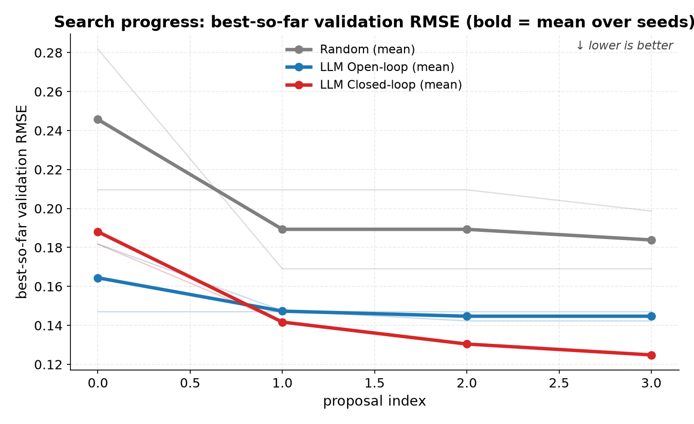

### validation_rmse_distribution
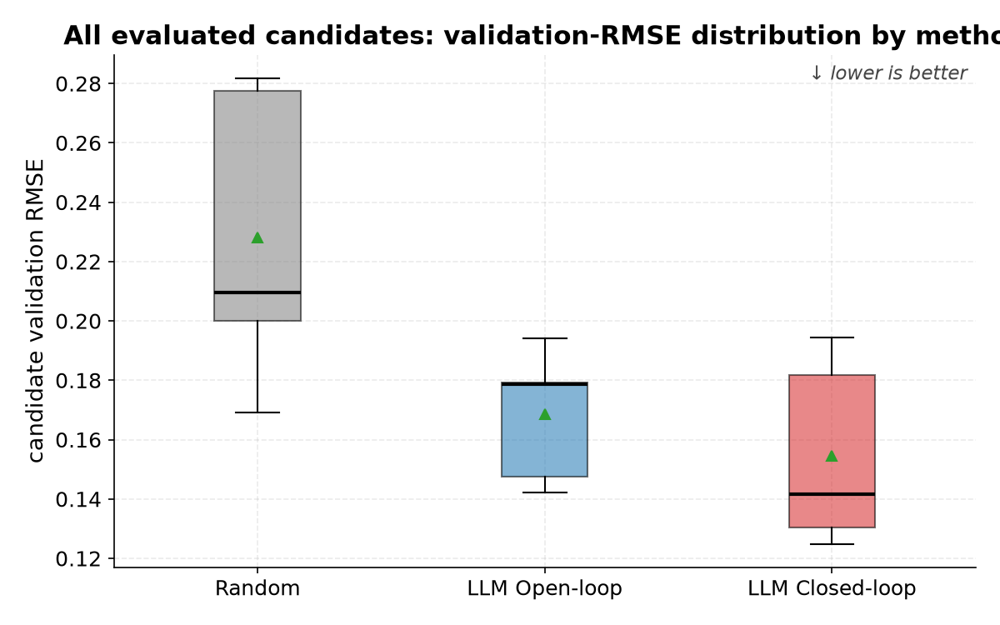

### test_rmse_by_arm
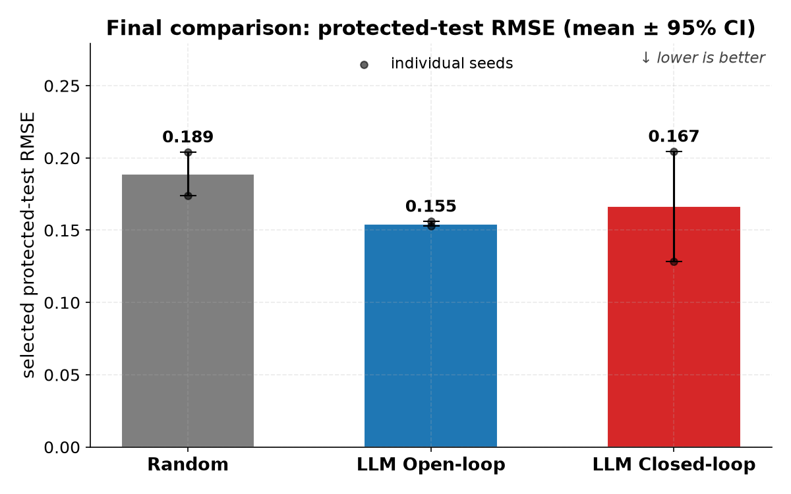

### prediction_vs_target
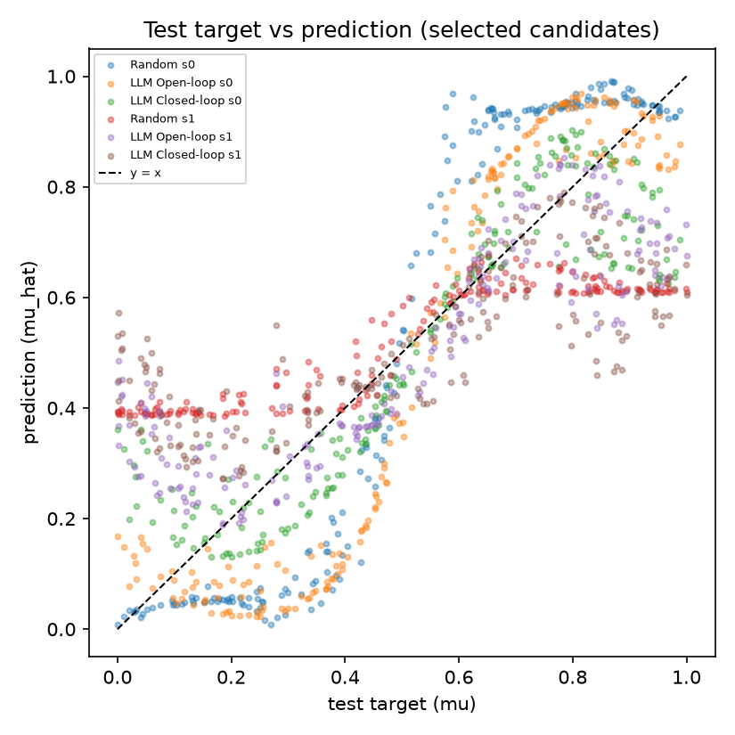

### complexity_vs_rmse
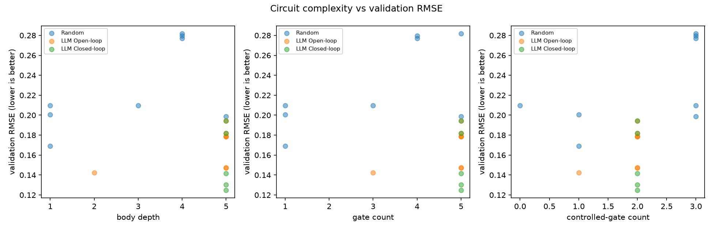

### closed_loop_theta_trajectory
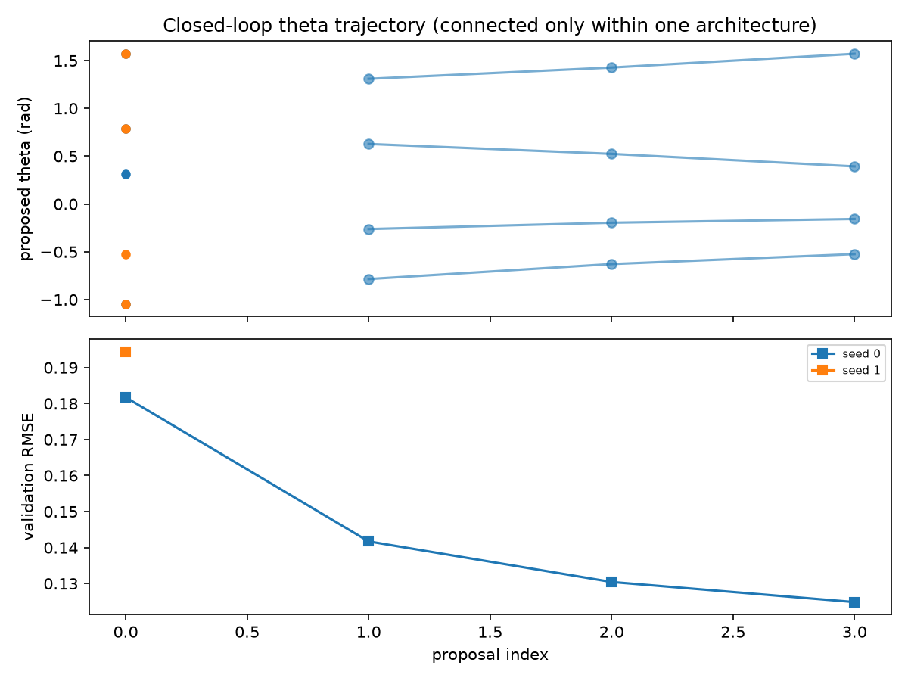

### proposal_outcomes
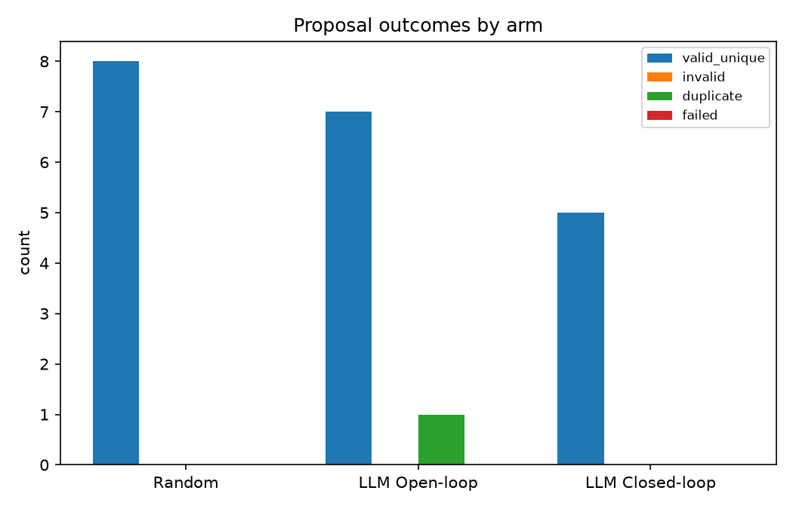

### expressibility_by_arm
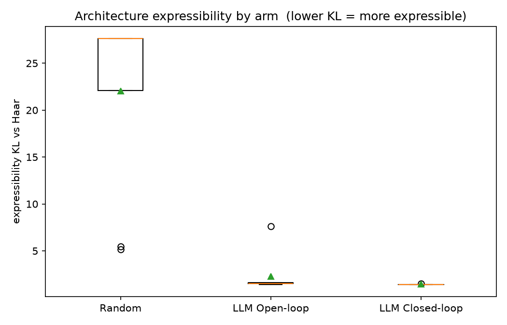

### entangling_capability_by_arm
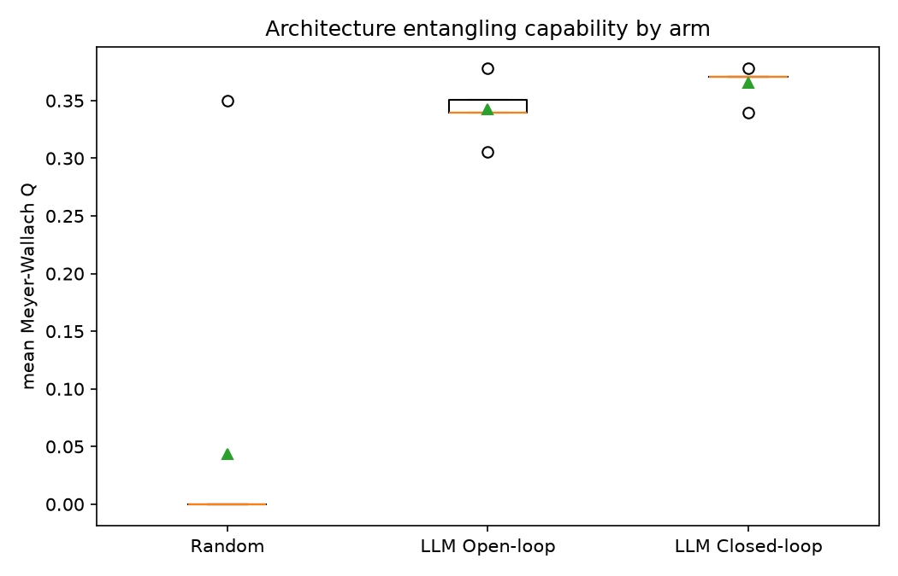

### expressibility_vs_validation_rmse
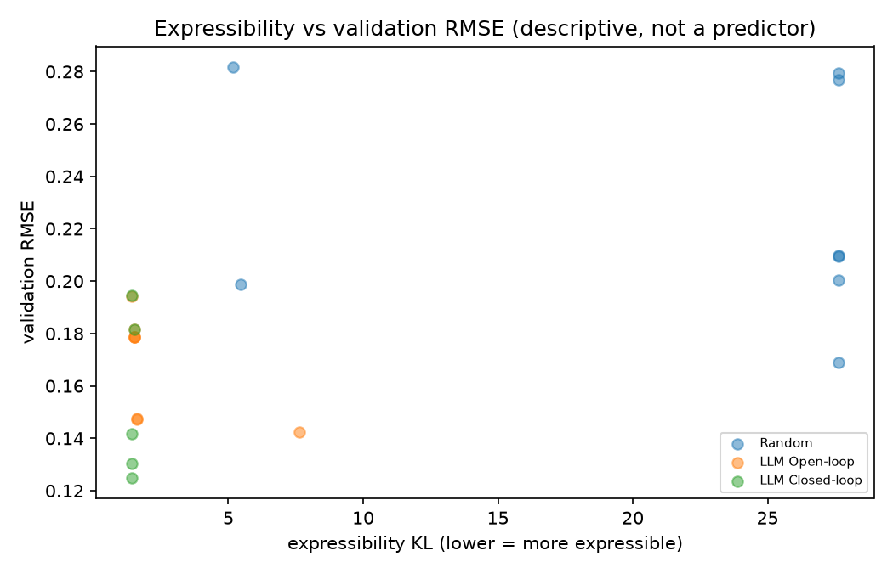

### entanglement_vs_validation_rmse
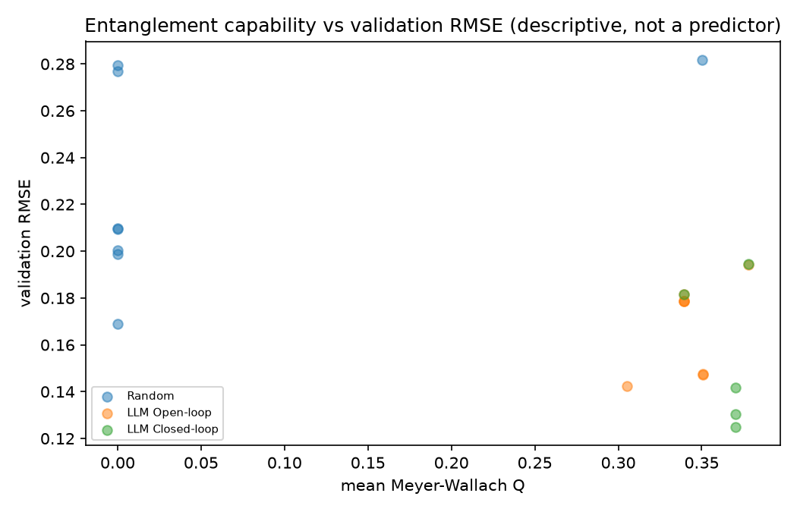

### expressibility_vs_entanglement
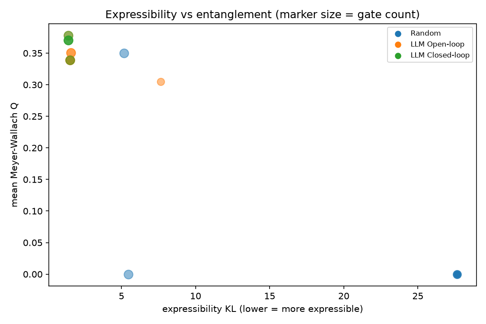

### selected_fidelity_histograms
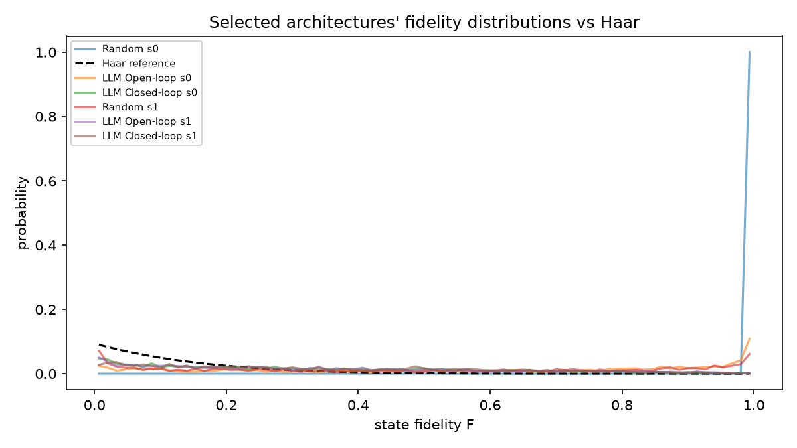

### selected_entanglement_distributions
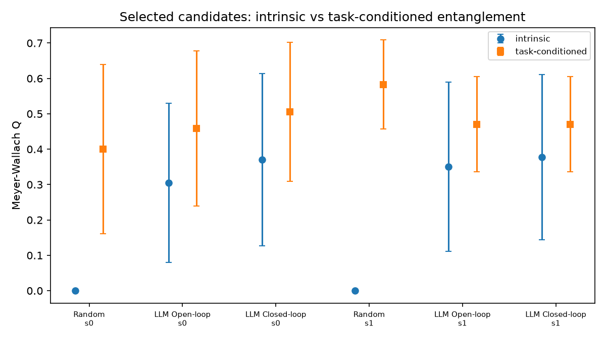

### selected_circuits
Readable circuit diagram (gates, wires, theta) per arm/seed under `figures/selected_circuits/` (PNG + SVG + a robust `.txt` rendering).

## Expressibility and entanglement are descriptive diagnostics
Expressibility (fidelity KL vs Haar; lower = more expressible) and entanglement capability (Meyer-Wallach Q) are computed per unique architecture from |0...0> (amplitude encoding excluded), cached by `architecture_hash`. They are reported as descriptive diagnostics and are NOT assumed to predict RMSE. A single fixed-theta value is never called 'expressibility' -- expressibility is a distribution over the whole parameter space.

## Amplitude-encoding limitation
L2 amplitude normalization removes overall multiplicative scale: two samples differing only by a positive amplitude factor A become the same normalized quantum state before noise. Only the peak location (mu) is targeted; absolute signal magnitude is not recoverable.

---
# REAL-LLM JOINT-SEARCH RUN (OpenAI)
Mock / non-LLM demonstration; zero real API calls; not a scientific claim.