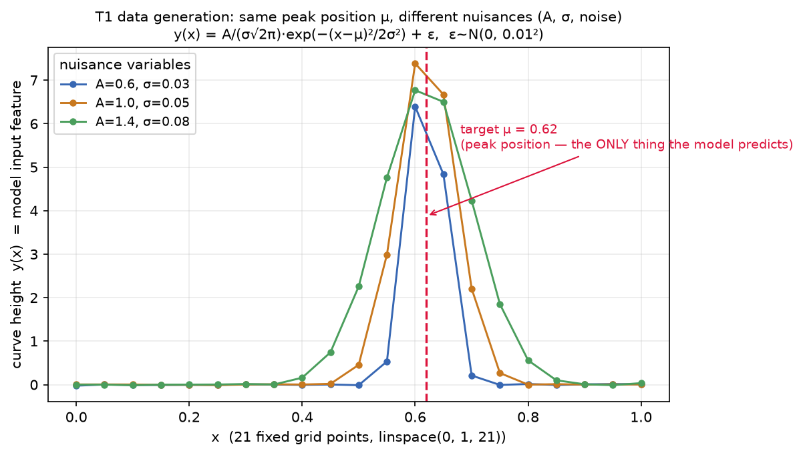
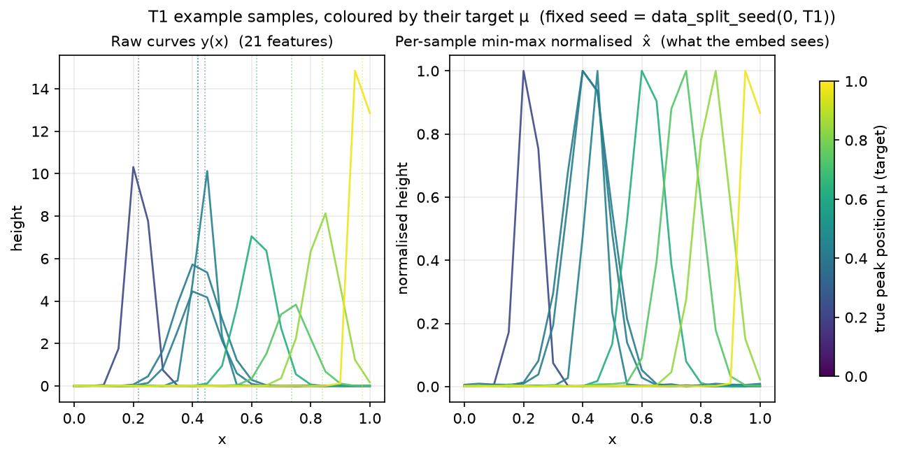
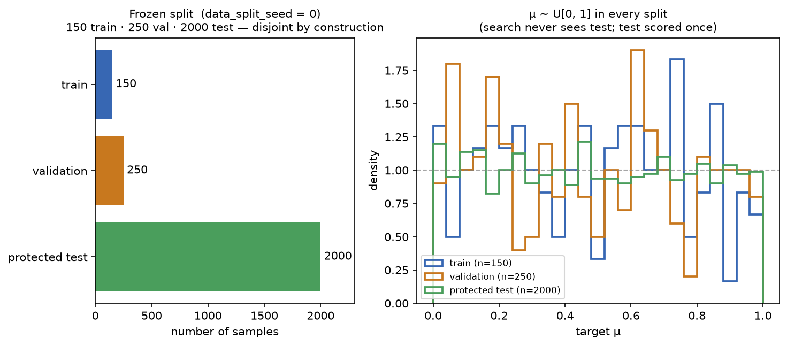

# 1 · The scientific task and the data (T1)

**Source of truth:** `llm_vqc/tasks/t1_gaussian.py`, `llm_vqc/evaluation/seeds.py`.
Every number below is taken from that code, not from the slide deck.

## What the model is asked to do — in one sentence

> Given a noisy 1-D bump sampled at 21 fixed positions, **predict the position
> of its peak** — and do so despite the bump's height, width, and measurement
> noise varying from sample to sample.

**The regression target is `μ`, the Gaussian peak position.** Nothing else. This
is stated plainly because the deck never states it.

## The generative model

Each sample is a Gaussian evaluated on a fixed grid `x = linspace(0, 1, 21)`
(21 points), plus i.i.d. noise (replicating Knipfer et al. 2026 §3.3, the
mentors' predecessor work this task is built to be comparable with):

```
y(x) = A / (σ·√(2π)) · exp( −(x − μ)² / (2σ²) )  +  ε
```

| Symbol | Distribution | Role |
|---|---|---|
| `μ` | `U[0, 1]` | **peak position — the regression target** |
| `A` | `U[0.5, 1.5]` | amplitude (**nuisance**) |
| `σ` | `U[0.01, 0.1]` | width (**nuisance**) |
| `ε` | `N(0, 0.01²)` i.i.d. per point | additive noise (**nuisance**) |

- **Raw model input:** the length-21 vector of curve heights `y(x)`.
- **Target:** the scalar `μ`, already in `[0, 1]` by construction (no target
  scaling needed).

### Why this is non-trivial

The peak height and width carry **no information** about where the peak is. A
model that keyed on amplitude or overall scale would fail, because `A` and `σ`
are randomized independently of `μ`. The model must localize the peak's
**position** while being invariant to how tall or wide it is and to per-point
noise. That is exactly what makes it a meaningful — if small — regression probe.



*Three curves that share `μ = 0.62` but differ in `A` and `σ`. The target (red
dashed line) is the same for all three; everything else about the curves differs.
Generated by `scripts/build_methodology_figures.py`.*

## Preprocessing — per-sample min-max normalization

Before the model sees a sample, each row is min-max normalized **within its own
21 points** (Knipfer et al. Eq. 2):

```
x̂_i = (x_i − min_j x_j) / (max_j x_j − min_j x_j + 1e-12)
```

This is a **stateless per-row transform** — it has no parameters fitted on the
training set, so "fit on train only" holds vacuously. (It is still wrapped as a
`FittedPreprocessing` for interface parity with T2, which does fit a PCA.)



*Left: raw curves. Right: the same curves after per-sample min-max
normalization — this is what the trainable embedding actually receives. Colour
encodes the target `μ`. Note the peak position (colour) is preserved by
normalization while absolute height is removed.*

## The frozen splits

The split is generated once from a **frozen data-split seed** and shared by
every arm and every repetition seed, so the split is never a confound. The seed
is derived deterministically as `data_split_seed(run_seed=0, "T1_gaussian_peak")`
via `numpy.random.SeedSequence` (see `evaluation/seeds.py`).

| Split | Size | Used for |
|---|---:|---|
| Train | **150** | gradient updates during training |
| Validation | **250** | the metric search optimizes / selects on |
| Protected test | **2000** | scored **exactly once**, after selection |

Splits are **disjoint by construction**, not merely by check: because the data
is synthetic and unlimited, `build_test` advances the *same* RNG stream past the
train and validation draws before drawing the 2000 test samples, guaranteeing no
overlap (`assert_disjoint_splits` also verifies train/val).



*Left: the 150 / 250 / 2000 split. Right: `μ ~ U[0,1]` holds in every split; the
search never sees the test partition.*

## Loss vs. metric

- **Optimization loss:** MSE (`torch.nn.MSELoss`), minimized during training.
- **Reported / selection metric:** RMSE (= √MSE on the held-out set).
- **Direction:** **lower RMSE is better** (`lower_is_better=True` in the
  `TaskSpec`).

RMSE is reported (not MSE) because it is in the same units as `μ` — an RMSE of
0.009 means the peak position is localized to within ~0.9% of the `[0,1]` range.

---

**Next:** [`02_MODEL_AND_PARAMETERS.md`](02_MODEL_AND_PARAMETERS.md) — how the
21 inputs become a prediction, and the five distinct kinds of parameter involved.
