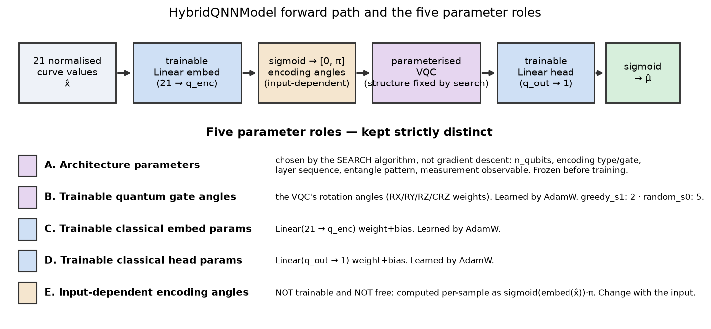
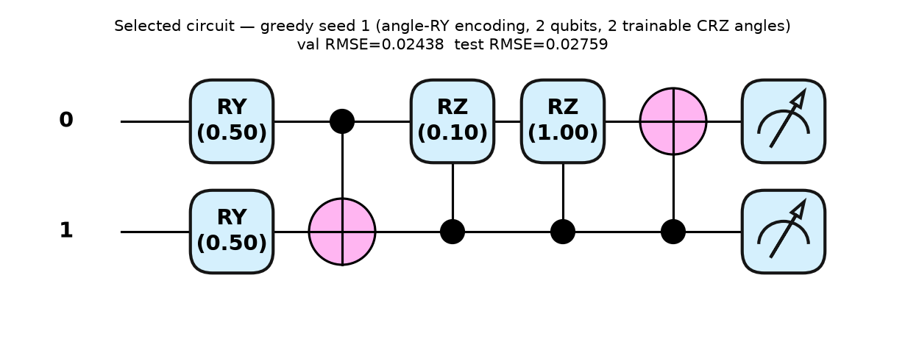
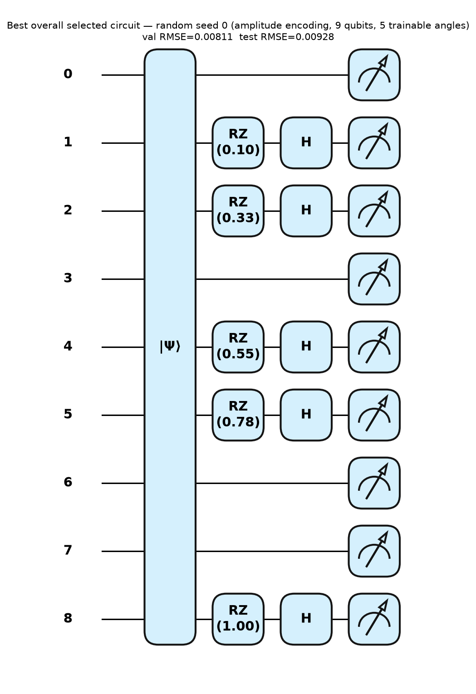

# 2 · The model and its five kinds of parameter

**Source of truth:** `llm_vqc/evaluation/model.py`, `llm_vqc/ir/expand.py`,
`llm_vqc/ir/compiler_pennylane.py`, `llm_vqc/ir/schema.py`.

## The forward path

`HybridQNNModel` is a hybrid classical–quantum regressor matching Knipfer et
al.'s "Simple QNN" wrapper exactly:

```
21 normalized curve values  x̂
   │
   ▼  trainable classical Linear embed        (21 → q_enc)      ← params C
   │
   ▼  sigmoid · π  →  encoding angles in [0, π]                 ← quantity E (angle encoding only)
   │
   ▼  parameterised VQC  (structure fixed by search)            ← structure A, angles B
   │
   ▼  quantum expectation values  ⟨O⟩         (one per measured wire)
   │
   ▼  trainable classical Linear head          (q_out → 1)      ← params D
   │
   ▼  sigmoid  →  predicted peak position  μ̂  ∈ (0, 1)
```

The embed layer's output width is **not** hard-coded: it is
`build_program(ir).num_inputs`, derived per circuit, because different proposed
circuits need different numbers of encoding wires. For **amplitude**-encoding
circuits the sigmoid·π step is skipped (PennyLane's `AmplitudeEmbedding`
normalizes internally); for **angle** encoding it bounds the otherwise-unbounded
linear output into a valid rotation-angle range.



## The five kinds of parameter — kept strictly distinct

The deck never separated these; conflating them is the most common source of
confusion about "what is being trained." They are genuinely different objects:

| # | Kind | Set by | Trainable by gradient descent? | Example (`greedy_s1`) |
|---|---|---|---|---|
| **A** | **Architecture parameters** | the **search algorithm** | ❌ no — frozen before training | `n_qubits=2`, angle-`RY` encoding, layer sequence, `line`/`pairs` entangle patterns, `Z` measurement |
| **B** | **Trainable quantum gate angles** | **AdamW** | ✅ yes | the 2 `CRZ` rotation angles (`weights[0..1]`) |
| **C** | **Trainable classical embed params** | **AdamW** | ✅ yes | `Linear(21 → 2)` weight + bias |
| **D** | **Trainable classical head params** | **AdamW** | ✅ yes | `Linear(2 → 1)` weight + bias |
| **E** | **Input-dependent encoding angles** | **the input `x̂`** | ❌ no, and not free — `sigmoid(embed(x̂))·π` | the 2 `RY` encoding angles, one per wire, **different for every sample** |

Key distinctions the deck blurred:

- **A is not learned.** The circuit *structure* is chosen by Random /
  Evolutionary / Greedy / LLM search and then held fixed while B, C, D are
  trained. Comparing search methods = comparing how well they pick **A**.
- **B, C, D are the only free (gradient-trained) parameters.** They are trained
  jointly by one AdamW optimizer over `model.parameters()`.
- **E is neither trained nor free.** Encoding angles are a deterministic function
  of the current input sample (through the trainable embed C). They change from
  sample to sample; they are how classical data enters the quantum circuit.

### Parameter counts are computed, never guessed

`build_program(ir).num_parameters` walks the linearized circuit and assigns one
flat-vector slot per parameterized gate application (`RX/RY/RZ` = 1 each; `CRZ`
= 1 each; `H/CNOT/CZ` = 0). This is the exact count `HybridQNNModel` binds into
the PennyLane `TorchLayer`. For the two shipped example circuits:

| Circuit | Encoding | n_qubits | Quantum angles (B) | Depth | Measurement |
|---|---|---:|---:|---:|---|
| `greedy_s1` | angle `RY` | 2 | **2** (`CRZ`×2) | 5 | `Z` on all |
| `random_s0` | amplitude | 9 | **5** (`RZ`×5) | 3 | `X` on all |

## Concrete selected circuits (actual, from their stored IR)

These are **not** illustrations — they are the exact circuits two pilot runs
selected on validation, drawn from their stored `CircuitIR` by
`scripts/build_methodology_figures.py`. Gate angles shown (e.g. `RY(0.50)`) are
placeholder bind values for the drawing; the real trained angles differ per run.



*`greedy_s1` — the clearest **angle-encoding** example. The first `RY` on each
wire is the **input-dependent encoding angle E**; the two controlled-`RZ` gates
are the **trainable quantum angles B**; `Z` is measured on both wires. Two
qubits, two trainable quantum angles — small enough to read end to end.*



*`random_s0` — the **best circuit found in the entire B=25 pilot** (val RMSE
0.00811). It uses **amplitude encoding**: the normalized 21-vector is padded to
2⁹ = 512 amplitudes and embedded as a quantum state, then a single shallow
rotation layer (`RZ`/`H` on 5 wires, 5 trainable angles) precedes an `X`
measurement. This is why the best pilot circuits look nothing like the
hand-drawn "one ansatz" picture — the search genuinely explores encoding type,
qubit count, and measurement basis.*

---

**Next:** [`03_TRAINING.md`](03_TRAINING.md) — the exact forward → loss →
backward → update cycle, initialization policy, and training curves.
