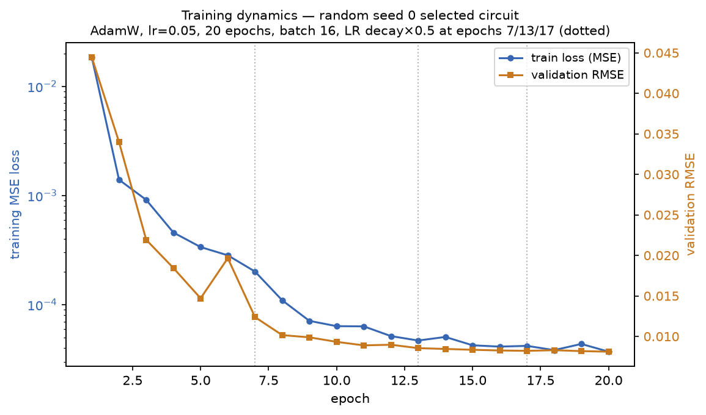

# 3 · How training actually proceeds

**Source of truth:** `llm_vqc/evaluation/training.py`, `llm_vqc/evaluation/seeds.py`.

The deck says "AdamW, 20 epochs" and stops. This document is the full cycle.

## The fixed training configuration

Every arm, on this task, trains through the **one** `train_model` function with
the **one** `TrainingConfig` — nothing is chosen per-arm (that is what makes the
comparison fair). The master-plan defaults:

| Hyperparameter | Value |
|---|---|
| Optimizer | AdamW |
| Learning rate | 0.05 |
| Epochs | 20 |
| Batch size | 16 |
| LR schedule | MultiStepLR, ×0.5 at epochs **7, 13, 17** |
| Weight decay | 1e-5 |
| Loss | MSE |
| Device / dtype | CPU / float64 |
| Early stopping / checkpointing | **none** (matches Knipfer et al. exactly) |

## Parameter initialization policy

Reproducibility is not a single global seed — it is a tree of independent
sub-seeds (`numpy.random.SeedSequence`). For one training run, `train_seed`
(itself `train_seed_for_circuit(run_seed, structural_hash)` — a pure function of
the run seed and the circuit's structural hash, so **the same circuit gets the
same initialization in every arm**) spawns four independent child streams:
`param_init`, `minibatch`, `training`, `backend_sampling`.

Before the model is built, `torch.manual_seed(param_init)` is set. Therefore:

- **Classical embed (C) and head (D):** PyTorch's default `Linear`
  initialization (uniform Kaiming bounds), seeded by `param_init`.
- **Quantum gate angles (B):** PennyLane `TorchLayer`'s default weight
  initialization, drawn from the same seeded generator.

There is no special quantum-aware init (e.g. small-angle or identity-block init);
the policy is "PyTorch/PennyLane defaults under a documented seed." Because the
seed is derived from the structural hash, initialization is **deterministic and
arm-independent**.

## The forward → loss → backward → update cycle

For each of the 20 epochs, the 150 training samples are shuffled (via the
`minibatch` seed) and processed in batches of 16. For each batch:

```
1. FORWARD    prediction = model(x_batch)
                 = sigmoid( head( VQC( sigmoid(embed(x̂))·π ) ) )      # angle enc.
2. LOSS       loss = MSELoss(prediction, μ_batch)
3. GUARD      if not isfinite(loss): abort this run as FAILED (recorded, never crashes the harness)
4. BACKWARD   loss.backward()            # autograd through torch + PennyLane (parameter-shift / backprop)
5. UPDATE     optimizer.step()           # AdamW updates B, C, D jointly
              optimizer.zero_grad()
6. (after each epoch) scheduler.step()   # halve LR at epochs 7/13/17
```

At the **end of every epoch**, the model is put in eval mode and scored on the
**full 250-sample validation set**, producing one validation RMSE per epoch. The
per-epoch training loss (mean over batches) and validation RMSE are both stored.

Gradients flow through the quantum layer: PennyLane's `TorchLayer` makes the VQC
a differentiable `torch.nn.Module`, so a single `loss.backward()` differentiates
the classical embed, the quantum angles, and the classical head together.

## What a real run looks like

Below is the actual training of the best pilot circuit (`random_s0`),
**re-trained deterministically** by the figure script — its final validation RMSE
reproduces the stored value `0.008114592` to 1e-9, which the build asserts.



*Training MSE loss (log scale, left axis) and validation RMSE (right axis) per
epoch. Dotted lines mark the LR-decay epochs (7/13/17); the validation RMSE
settles into its final basin right after the first decay. No early stopping —
all 20 epochs always run.*

## Failures are data, not crashes

`train_model` never raises. A non-finite loss (divergence) or a backend error is
caught and returned as an unsuccessful `TrainingOutput` with an `error_message`;
the harness records the candidate as `FAILED` (consuming budget) and the search
loop continues. This is what lets the project report invalid / duplicate /
failed rates as distinct statistics rather than losing runs to exceptions.

## The trained model is what gets tested

On success, `train_model` returns both the quantum weights and the **full
classical `state_dict`**. These exact weights are persisted to the result store.
The protected final test (next document) **reloads these weights** and scores
them once — it never retrains — so "selected on validation, scored on test"
means literally the same trained model.

---

**Next:** [`04_ARCHITECTURE_SEARCH_AND_SELECTION.md`](04_ARCHITECTURE_SEARCH_AND_SELECTION.md).
