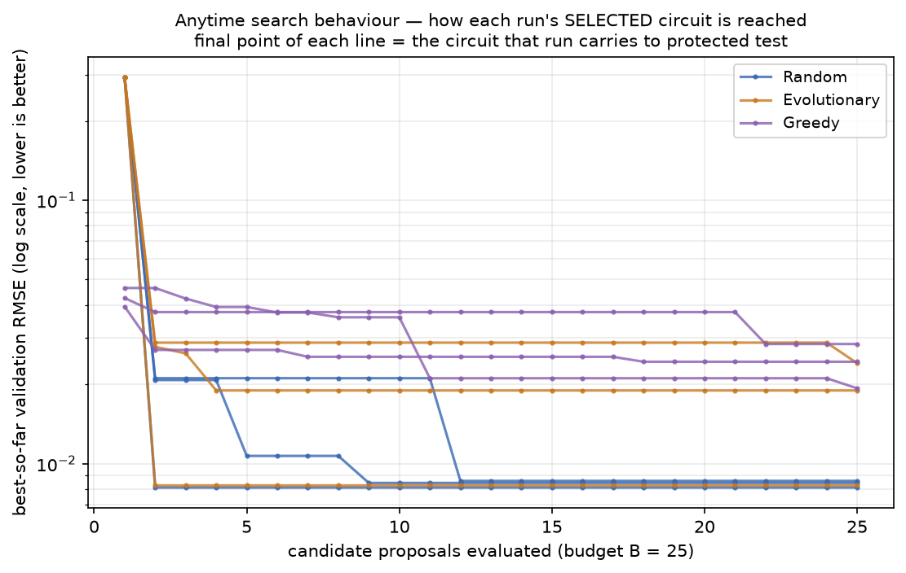

# 4 · How architectures are searched and selected

**Source of truth:** `llm_vqc/search/runner.py`, `llm_vqc/search/arms/*.py`,
`llm_vqc/evaluation/harness.py`.

## Five implementations → six experimental conditions

This resolves the deck's "five vs. six" ambiguity (Slide 4 vs. Slide 10):

| Experimental condition | Implementation class (file) | How it differs |
|---|---|---|
| Random | `RandomArm` (`random_arm.py`) | each proposal is an independent uniform draw from the IR grammar; ignores feedback (the uninformed control) |
| Evolutionary | `EvolutionaryArm` (`evolutionary_arm.py`) | (μ+λ) elitist evolution strategy with hand-coded mutation/crossover over the IR |
| Greedy | `GreedyArm` (`greedy_arm.py`) | layer-wise growth from a fixed minimal circuit; each round keeps the best of *k* single-layer extensions |
| LLM Open-loop | `LLMIterArm(open_loop=True)` | LLM proposes circuits **blind** — no scores returned between proposals |
| LLM Closed-loop | `LLMIterArm(open_loop=False)` | LLM sees validation feedback for its prior proposals (conversational) |
| LLM Evolutionary | `LLMEvoArm` (`llm_evo_arm.py`) | LLM performs the mutation/crossover step of an evolutionary loop |

So there are **five arm classes** and **six conditions** — open- and closed-loop
are the *same* class (`LLMIterArm`) toggled by a flag. Both statements in the
deck are true; the package states both explicitly.

## One shared loop, no arm-specific shortcuts

Every condition runs through the identical `SearchRunner.run()` loop, which
guarantees fairness by construction:

```
while not ledger.is_exhausted(budget_limit):          # exact budget, checked every proposal
    raw_proposal = arm.propose(state)                 # the ONLY arm-specific step
    result = evaluate_candidate(raw_proposal, ...)    # shared validate → compile → train → score
    feedback = SearchFeedback.from_evaluation_result(result)   # validation-only fields
    state = arm.update_state(state, raw_proposal, feedback)
    save_run_state(...)                               # checkpoint after every proposal
```

- An arm **cannot bypass** IR validation, the shared compiler, the shared
  training protocol, or the budget ledger — `evaluate_candidate` does all of it.
- An arm **cannot reach test data**: `SearchRunner` never imports
  `final_test.py`, and the `SearchFeedback` it hands the arm has no test field.
- **Budget accounting** distinguishes VALID / INVALID / DUPLICATE / FAILED.
  INVALID proposals do **not** consume budget (so a broken arm can't be starved);
  DUPLICATE (same structural hash, served from cache — not retrained) and FAILED
  do consume budget. This is what makes "exploration collapse" measurable.

## How the final circuit is chosen — validation, always

Each arm tracks a **best-so-far by validation metric** (`is_strictly_better`,
which never lets a tie displace the incumbent). When the budget is exhausted,
`arm.select_final(state)` returns the structural hash of the single circuit with
the best validation RMSE that arm saw. That — and only that — circuit is carried
across the quarantine boundary to the protected test.

Selection is therefore a pure argmin over **validation** RMSE. The anytime curve
below *is* the selection process: the final point of each line is the circuit
that run selects.



*Best-so-far validation RMSE vs. proposals evaluated, all 9 non-LLM pilot runs
(B=25). Random (blue) descends fastest and lowest here; Greedy (purple) is
slower because it spends early budget on small layer-wise extensions from a
2-qubit start. The **final value of each line** is that run's selected circuit's
validation RMSE — the exact numbers reported in §6.*

### Why the arms behave differently (visible in the curves)

- **Random** draws freely from the whole grammar every step, so it can stumble
  onto a strong amplitude-encoding circuit early (all three random runs selected
  amplitude-encoding circuits).
- **Greedy** starts from a fixed 2-qubit minimal circuit and grows one layer at a
  time; its selected circuits are consequently small 2-qubit angle-encoding
  circuits — good, but it explores a narrower structural neighborhood at B=25.
- **Evolutionary** shows high duplicate rates (9–14 of 25 proposals were
  duplicates) as the population converges — visible as flat segments in its
  curves and a real efficiency cost the budget accounting captures.

---

**Next:** [`05_VALIDATION_AND_FINAL_TEST.md`](05_VALIDATION_AND_FINAL_TEST.md) —
the quarantine boundary between the validation the search optimizes and the test
it is forbidden to see.
