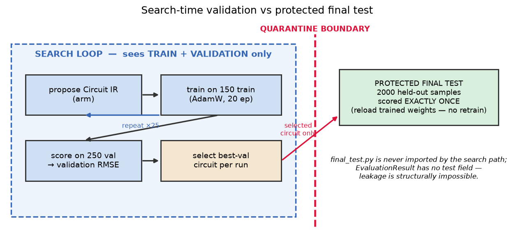

# 5 · Search-time validation vs. protected final test

**Source of truth:** `llm_vqc/evaluation/harness.py`,
`llm_vqc/evaluation/final_test.py`, `llm_vqc/evaluation/results.py`,
`llm_vqc/tasks/base.py`.

This is the project's strongest methodological guarantee, and the deck states it
as a single bullet. It deserves the emphasis below because the guarantee is
**structural** — enforced by the type system and the import graph, not by a
convention that a careless change could break.



## Two metrics, two roles

| | Validation RMSE | Protected test RMSE |
|---|---|---|
| Split | 250 samples | 2000 samples |
| Seen during search? | **yes** — every candidate is scored on it | **never** |
| Role | the number the search **optimizes and selects on** | the number reported **once**, after selection |
| Computed by | `harness.evaluate_candidate` | `final_test.evaluate_on_test` |
| Retrains? | trains each candidate once | **no** — reloads the selected model's exact weights |

## Why leakage is structurally impossible

Three independent barriers, any one of which suffices:

1. **The search evaluator is typed to never receive test data.**
   `evaluate_candidate` takes a `TrainValData`, and that dataclass **has no
   `test` attribute**. There is no argument, flag, or code path that could pass
   test data to a search arm.

2. **The search result type has no field for a test metric.**
   `EvaluationResult` — the only object handed to any arm or LLM — has
   `val_metric_*` fields and **no test field**. A test number cannot ride along
   in the feedback because there is nowhere to put it. `FinalTestResult` is a
   *separate*, non-inheriting class.

3. **The code that can compute a test metric is never imported by the search
   path.** `final_test.py` is imported only by the top-level experiment scripts,
   *after* a run finishes — never by `harness.py` or `search/runner.py`. This is
   asserted in `tests/test_search_framework.py`.

## The order is never reversed

Per run, the sequence is strictly:

```
search (train+val, B=25 proposals)  →  select best-val circuit  →  reload its weights  →  score once on 2000 test
```

`final_test.evaluate_on_test` rebuilds the model for the selected IR, checks that
the stored `state_dict` keys match exactly (guarding against scoring the wrong
circuit), loads the **already-trained** weights, and evaluates on the test split
in a single `torch.no_grad()` pass. If it retrained, the protocol would collapse
into "score whatever the test-time initialization happened to favor" — which is
precisely what the reload prevents.

## What this buys the science

Because the test set is touched exactly once per selected circuit and never
enters any feedback loop, the reported test RMSE is an **unbiased** estimate of
the selected architecture's generalization — for *every* arm, on identical terms.
When the full B=60 matrix runs, "did the LLM help?" reduces to comparing these
protected-test numbers across arms, with no arm having had privileged access to
the answer key.

---

**Next:** [`06_RESULTS.md`](06_RESULTS.md) — the actual numbers and what they do
and do not support.
