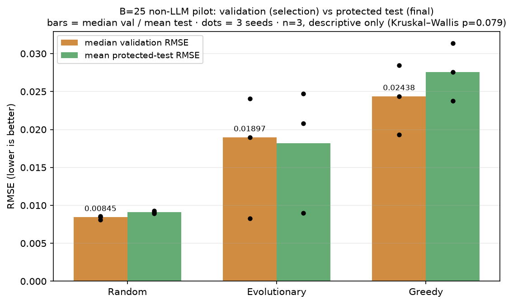
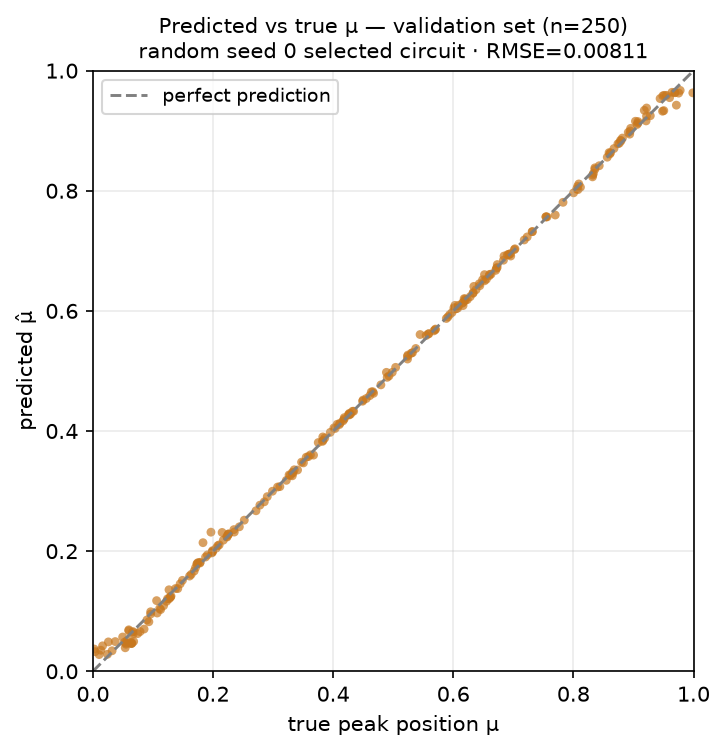

# 6 · Results — what the numbers and figures actually show

**Source of truth:** `runs/pilot_t1/` (non-LLM pilot, re-derived into
`data/pilot_nonllm.json`), `docs/presentation/groq_pilot/`,
`docs/presentation/mini_llm_experiment/`. All figures regenerate offline via
`scripts/build_methodology_figures.py`. **Lower RMSE is better.**

> **Read this first.** Every result on this page is a **small, descriptive,
> underpowered pilot** (n ≤ 3 seeds). None supports an LLM-superiority, quantum-
> advantage, or HEP-domain claim. Their purpose is to show the infrastructure
> produced real, leakage-safe measurements — not to rank methods.

---

## 6.1 · The B=25 non-LLM pilot (Random / Evolutionary / Greedy)

**Config:** T1, frozen split seed 0, budget B=25, 3 seeds per arm, full training
(AdamW, 20 epochs). Only these three arms were run — under the governing cost
policy no paid LLM call was authorized, and running LLM arms with a *mock*
provider and reporting them as "LLM results" was correctly refused.

### Per-run: selected (validation) and protected (test) RMSE

| Arm | Seed | Selected **validation** RMSE | Protected **test** RMSE | Duplicates |
|---|---:|---:|---:|---:|
| Random | 0 | 0.008115 | 0.009281 | 0 |
| Random | 1 | 0.008450 | 0.008909 | 0 |
| Random | 2 | 0.008602 | 0.009102 | 0 |
| Evolutionary | 0 | 0.024064 | 0.024700 | 9 |
| Evolutionary | 1 | 0.018966 | 0.020810 | 14 |
| Evolutionary | 2 | 0.008269 | 0.009002 | 13 |
| Greedy | 0 | 0.019320 | 0.023746 | 3 |
| Greedy | 1 | 0.024375 | 0.027589 | 2 |
| Greedy | 2 | 0.028460 | 0.031345 | 1 |

### Aggregates

| Arm | **Median validation** RMSE (= the deck's Slide-8 number) | **Mean test** RMSE | Median test RMSE |
|---|---:|---:|---:|
| Random | **0.00845** | 0.00910 | 0.00910 |
| Evolutionary | **0.01897** | 0.01817 | 0.02081 |
| Greedy | **0.02438** | 0.02756 | 0.02759 |

**This table is the audit's headline correction.** The bolded middle column is
exactly what Slide 8 printed and mislabeled as "Mean Test RMSE." The true mean
test values are the next column — different numbers *and* a different quantity.
See [PRESENTATION_AUDIT.md](PRESENTATION_AUDIT.md).

*Median validation (orange) beside mean protected-test (green), dots = 3 seeds.
Validation and test track each other closely — the quarantine did not produce a
large optimism gap at this scale — but they are distinct measurements and must be
labeled as such.*

### Statistics — honestly underpowered

Kruskal–Wallis across the three arms at budget 25: **H = 5.07, p = 0.079**
(`pilot_analysis.json`). With n = 3 seeds per arm this is **descriptive and
underpowered**; the analysis script reports effect sizes and estimates rather
than declaring significance. No arm is claimed to beat another. Pairwise
Mann–Whitney U with Holm correction leaves nothing significant (all p_holm ≥ 0.3).

### The best circuit found, as a regressor

*The best pilot circuit (`random_s0`) predicting peak position `μ` on the 250
validation samples: predictions hug the diagonal with RMSE 0.00811 — the peak is
localized to ~0.8% of the `[0,1]` range despite randomized amplitude, width, and
noise.*

---

## 6.2 · OpenAI mini real-API integration (5 arms, n=1, B=2, 1 epoch)

A **time-boxed smoke integration**, not a comparison — 4 real
`gpt-5.4-mini-2026-03-17` calls, 9.8 s wall-clock, **1 training epoch**. Its
RMSEs (0.13–0.29) are an order of magnitude worse than the 20-epoch pilot purely
because of the 1-epoch cap, and are **not comparable** to §6.1. What it
establishes: the OpenAI provider path really runs end-to-end — real proposals,
schema-parsed, validation-only feedback, protected test scored after search, all
under budget. See [`../mini_llm_experiment/`](../mini_llm_experiment/).

| Arm | Consumed | Validation RMSE | Protected test RMSE |
|---|---:|---:|---:|
| random | 2/2 | 0.292942 | 0.292311 |
| evolutionary | 2/2 | 0.131343 | 0.133476 |
| greedy | 2/2 | 0.130074 | 0.132825 |
| llm_iter open-loop | 2/2 | 0.174413 | 0.172725 |
| llm_iter closed-loop | 2/2 | 0.132116 | 0.132024 |

Real usage: 4 calls, 1247 input + 656 output tokens, per-call latency 1.3–3.6 s.
Dollar cost is **not** reported — OpenAI's chat completions API returns no
per-call price and none was fabricated; token counts and latency are the
authoritative record, and the server-reported model snapshot confirms the calls
were real, not mocked.

---

## 6.3 · Groq free-tier pilot (interrupted) — what really happened

The deck frames this slide around failure and "system timeouts." The stored
evidence supports a **more precise and more useful** story, and the repo already
contains the plots to tell it. See [`../groq_pilot/`](../groq_pilot/).

**Correct framing:** not a "system timeout" — **severe free-tier rate-limit
backoff and a deliberate experiment interruption.**

**Run matrix (B=10):** 9 complete non-LLM cells, **2 interrupted** `llm_open`
cells, **7 not-started** cells. Incomplete cells are never compared as if complete.

**What did run (real, verified):**
- All 9 non-LLM cells completed; median validation RMSE 0.0201 (random), 0.0203
  (evolutionary), 0.0288 (greedy) — with protected test scored for each.
- 31 real `openai/gpt-oss-20b` calls, 7,529 reported tokens.

**The two real failure modes (both genuine, both worth showing):**
1. **Semantic invalidity: 83.9%** of the 31 LLM proposals were invalid — the
   recurring cause (from stored validation errors) is wire fields emitted as
   strings instead of integer arrays. Strict JSON-schema conformance did **not**
   guarantee semantically valid `CircuitIR` under this low-reasoning config. This
   is model-, prompt-, and config-specific.
2. **Rate-limit latency explosion:** mean call latency rose from **9.4 s**
   (seed 0) to **657.7 s** (seed 1), with individual backoffs of 117–768 s. The
   run was interrupted rather than waiting out the remaining matrix; the
   `BudgetLedger` preserved partial state and can resume.

**Show these existing plots** instead of only the failure text:
`groq_anytime_curves`, `groq_val_performance`, `groq_test_performance`,
`groq_proposal_rates`, `groq_llm_usage` (all in `../groq_pilot/`, PNG + SVG).

---

## 6.4 · What is and isn't supported

**Supported:** a leakage-safe, reproducible, budget-accounted evaluation harness
runs real 20-epoch VQC training and two real LLM provider paths; the non-LLM
arms produce clean validation/test measurements; both LLM integrations exposed
concrete, real-world failure modes (rate limits; semantic invalidity).

**Not supported (by any result here):** LLM superiority or inferiority; any
completed budget-matched LLM-vs-classical comparison; quantum advantage; any
HEP-domain claim (T1 is a synthetic 1-D probe). These await the full B=60 matrix.

---

**Back to:** [README.md](README.md) · [PRESENTATION_AUDIT.md](PRESENTATION_AUDIT.md)
